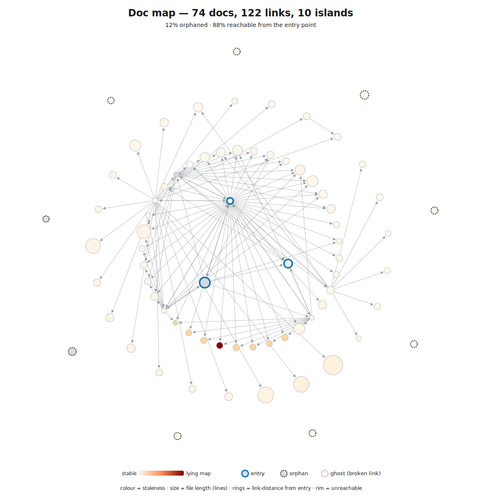

# Codebase Assessment: ai-native-toolkit

_Generated 2026-06-04. Generated by `/assess` v1.35.0._

**Score: 7.0 / 8 - AI-Native** · Keyhole: 8 structural concerns (7 hidden coupling, 1 lying map), 1 safe zone.

> This is an improvement roadmap, not a verdict - a **Missing** or **Partial** locates where someone working here is partly blind, not a mark against the code.

## Top 3 Actions

Actions 1-2 cover the deterministic attention list (the `hidden_coupling` seam across `scripts` / `scripts/tests` / `skills/assess`, plus the `lying_map` on `skills/assess/scripts/lib/README.md`); Action 3 closes the single Missing scorecard layer (L6 coverage), the highest-leverage move from 7.0 toward 7.5.

| # | Action | Layer | Effort | Command / First Step | Hotspot files this addresses | Issue |
|---|--------|-------|--------|---------------------|------------------------------|-------|
| 1 | Extend the co-change seam map (`skills/assess/scripts/lib/README.md`, #117) to the full `scripts` <-> `scripts/tests` <-> `skills/assess` span so the coupling is owned, not just observed. Confirm it is intentional cohesion (one subsystem evolving together), not accidental entanglement - treat as a strangler-fig boundary only if the core is later split; do not rewrite working code. | 0/4 | medium | Add a "co-change seams" section to `skills/assess/scripts/lib/README.md` (or a sibling note) covering the `scripts/` build pipeline and its tests | `skills/assess/scripts/assess_core.py`, `skills/assess/scripts/lib/doc_graph.py`, `scripts/` | - |
| 2 | Re-anchor `skills/assess/scripts/lib/README.md` against the 2 `lib/` commits made since it was written (it is only 2 days old, so verify-and-refresh, not rewrite) so the high-confidence `lying_map` signal clears. | 0 | small | `git log 46c308e..HEAD -- skills/assess/scripts/lib/` then reconcile the README's module responsibilities against the diff | `skills/assess/scripts/lib/README.md` | - |
| 3 | Add a coverage step with a patch-coverage floor, then pilot mutation testing on the deterministic core to confirm the 33 test files pin behaviour rather than just execute lines. | 6 | medium | Add `pytest --cov` to `tests.yml` with a patch floor; pilot `mutmut`/`cosmic-ray` on `skills/assess/scripts/lib/` | `skills/assess/scripts/lib/doc_graph.py`, `skills/assess/scripts/assess_core.py` | - |

### Why these three?

Actions 1 and 2 are the deterministic attention list - the only structural concerns the keyhole surfaced. The seam map (Action 1) makes the assess engine's genuine cohesion *owned and documented* rather than silently relied upon; Action 2 keeps that very doc honest, closing the one `lying_map` before it drifts further. Action 3 is the single highest-leverage scorecard move: L6 is the lone Missing layer - 33 tests run in CI but nothing measures whether they constrain behaviour, and the deterministic core (high aggregate complexity, heavy churn) is exactly where an unpinned survivor cluster would hide.

## Snapshots

### Complexity - riskiest to change

Every hotspot is in `skills/assess/scripts/` - the assessment engine auditing itself; per-function ccn p95 is 9 (against the C901 gate of 15), so the high file-aggregate numbers are sums of many small functions, and the few over-gate functions carry explicit `# noqa: C901` markers.

### Doc navigability - can an agent find its way?

88% link-reachable with `docs/index.md` now wired as a structural map-of-content (0 dangling, 0 broken links); the 12% orphans are `skills/*/references/` files reachable by path - a wayfinding nicety, not a truth gap.

📈 Snapshot detail (commit, hotspots, navigability, lying maps)

#### Complexity profile

- **Measured at commit:** `a683217f5bee` (2026-06-04) - **working tree had uncommitted changes; figures include un-committed edits** (the `.assess/` run artefacts written into this worktree)
- **Files scored:** 72 (70 lizard, 2 scc)
- **Churn window chosen:** last 12mo
- **Complexity profile:** per-function ccn p95 9 (max 40, across 1040 functions); file-aggregate ccn p95 112 (max 169); p95 LOC 491 (max 790)
- **Top hotspots** (composite `sqrt(ccn) × sqrt(1 + commits)` - a sub-linear blend of complexity and recent churn, so a complex-AND-active file leads, a frozen-but-complex file ranks below it, and a churny-but-trivial file can't top the list on churn alone). `ccn` here is the **file aggregate**; the worst single function per file is in parentheses:
  1. `skills/assess/scripts/assess_core.py` - 499 LOC, aggregate ccn 108 (worst function 40), 16 commits in window
  2. `skills/assess/scripts/complexity-treemap.py` - 489 LOC, aggregate ccn 117 (worst function 19), 11 commits in window
  3. `skills/assess/scripts/lib/doc_graph.py` - 514 LOC, aggregate ccn 169 (worst function 23), 7 commits in window

Size encodes lines of code, colour encodes cyclomatic complexity (dark red = high), saturation encodes recent git churn (vivid = active). Vivid red blocks are the migration risk. The hotspots are exactly the deterministic core of `/assess` itself - expected for an actively-developed analysis tool. The per-function ccn p95 of 9 confirms the high *aggregate* numbers (169 on `doc_graph.py`) are many small functions summed, not one monster function; `assess_core.py`'s worst function (ccn 40) carries an explicit `# noqa: C901` ratchet marker rather than slipping the gate.

#### Doc navigability

Of **74 docs**, about **88% are reachable** by following links from the entry points (`CLAUDE.md`, `README.md`, `docs/index.md`); only **12% are orphans** (nothing links to them), spread across **10 small islands**. `docs/index.md` is now wired as a structural map-of-content (it links 39 docs), which is what lifts reachability so high - a marked improvement over earlier runs where the figure was ~10%. The graph is **clean**: zero dangling links, zero broken links.

The remaining orphans concentrate in `skills/*/references/` (skill-internal reference files Claude Code loads by trigger, not by link-traversal) and `skills/assess/scripts/lib/README.md`. These are reachable by path - an agent can still `ls` and open any of them - so this is **curation, not access**: a low-priority wayfinding nicety, not a blocker. The 60+ "missing cross-references" (prose naming another doc's filename without linking it) are the same shape of low-effort polish.

**Lying maps.** The deterministic finding fired one credible `lying_map`: `skills/assess/scripts/lib/README.md` (`confidence: high`, `nearest-ancestor` association, subject code churned 58 commits in the window vs the doc's 1). Apply judgment, though: the README was last changed **2 days ago**, so the bulk of that 58-commit subject churn *predates the doc* - only ~2 `lib/` commits postdate it. So it is a watch-and-verify signal (reconcile the README against those 2 commits - Action 2), not a confidently frozen map. The ranked stale-*hubs* are all `subject_method: repo-baseline` / `confidence: low` (whole-repo churn proxy) and freshly edited, so none is reported as a hub-level lie.

Colour = staleness (vivid red = a frozen doc beside churning code); structure = reachability (centre = entry, rim = unreachable, dashed ring = orphan); size = file length. Open the SVG directly for per-node hover tooltips.

#### What changed since last run

_Diff suppressed - the prior snapshot was produced by plugin v1.23.0 (current is v1.35.0), and file-filter differences across versions surface phantom graduated/new transitions that didn't really happen. Cross-run comparison resumes once two runs share a plugin version._

📊 Full scorecard (per-layer evidence & gaps)

The two headline metrics measure **different things and are never combined.** The 0-8 score answers _"is the scaffolding in place to catch problems?"_ (a property of the contracts and enforcement layers). The Keyhole Readiness summary answers _"where is today's structural pain?"_ - a pure count of structural concerns and safe zones rolled up from the eight cross-layer findings. Here: strong scaffolding (7.0/8) over a small, cohesive, actively-developed subsystem whose files change together (the 7 hidden-coupling concerns) plus one doc-freshness watch.

The **What it asks** column is the question that layer answers for an agent working here - read it first; the framework name is secondary. The **Band** orders them by dependency.

| Layer | What it asks | Band | Status | Evidence | Gap |
|-------|--------------|------|--------|----------|-----|
| 0: Agent Instructions & Navigability | Can I build a true map of this codebase before I touch it? | read | **Present** | `instructions_grade: A` - `CLAUDE.md` (grade A, 207 lines, 28 positive directives, bloat penalty 0), `.github/claude-review-instructions.md` (grade A); 11 skills give genuine progressive disclosure; no broken instruction refs, nothing untracked, no sensitive content. Doc graph healthy: 0 dangling, 0 broken links, 88% reachable, `docs/index.md` wired as a structural MOC (out-degree 39), all 8 module dirs carry a base doc. | 12% orphan rate (skill `references/` + `lib/README.md`) and 60+ named-but-unlinked cross-references - low-severity wayfinding polish. No deterministic contradiction sweep of `docs/` (an LLM pass would catch any plan that contradicts shipped behaviour). |
| 1: Runtime Legibility / Liveness | Can I see which parts are live, which need attention, and which are dead weight? | read | **Partial** | Dead-code scan ran clean (vulture, 0 candidates). No deployed runtime - this is a CLI/skill plugin, so liveness is read through complexity + churn + reachability, not telemetry; observability rung 0 (`instrumented: false`). | Liveness of the skill scripts is a hypothesis confirmable only by named-human knowledge, not telemetry - there is none to instrument. Honest degrade, not neglect (scored Partial, not Missing). |
| 2: Code Design | Will the type-checker catch my mistakes? | write | **Present** | `mypy` configured in `skills/assess/pyproject.toml` (`files = ["scripts/lib"]`) and run as a blocking CI gate (`tests.yml` "ruff + mypy gates"); type hints throughout the lib modules. | mypy scope is `scripts/lib` only - `assess_core.py`, the top-level `scripts/`, and tests are not yet type-checked. The load-bearing lib is covered, so net Present. |
| 3: Linters | Are complexity and style bounds enforced, or will my code drift? | write | **Present** | `ruff` with the `C901` mccabe gate `max-complexity = 15`, enforced as blocking CI across both `skills/assess` and `scripts`. Per-function ccn p95 = 9 (under the bar); the handful of over-gate functions (`assess_core.py` worst function 40, `doc_graph.py` 23) carry explicit `# noqa: C901` ratchet notes - the gate fails the moment any *new* function exceeds 15. | - |
| 4: Architecture Tests | Are the structural conventions executable, or just folklore? | write | **Partial** | `plugin contract pytest` enforces the plugin structural contract as a required CI check: every skill has a valid `SKILL.md` with a `TRIGGER` clause, every marketplace entry exists on disk, internal links resolve, no placeholder tokens. The C901 ratchet fences complexity growth. | No self-imposed import-boundary / file-size architecture-contract test (ArchUnit-style) on the repo's own code; the structural tooling (`structure_graph.py`) analyses *targets*, not self. |
| 5: CI Pipeline | Does something automatically catch a bad change before it merges? | write | **Present** | 5 workflows (`tests.yml` = 3 pytest suites + ruff + mypy, `pr-lint.yml`, `claude-review.yml`, `assess-gate.yml`, `build-standalone-skills.yml`). Branch protection on `main`: 4 required checks (`skills/assess pytest`, `scripts/ pytest`, `plugin contract pytest`, `Validate PR title`), `enforce_admins: true` - failures block merge even for admins. | `required_approving_review_count: null` by design (solo-maintainer 0-approval policy). CI is comprehensive and blocking. |
| 6: Coverage Gates | Do the tests constrain behaviour, or just execute lines? | write | **Missing** | 33 test files run in CI, but there is no `codecov.yml` / `.coveragerc` / coverage threshold, no `--cov` in any workflow, and no mutation config. | No coverage floor, no patch-coverage gate, no mutation testing - the tests run but their behavioural pinning is unmeasured. The lone clear write-side hole. |
| 7: Code Review Bots | Is there design-level feedback on every change? | write | **Present** | `claude-review.yml` runs `anthropics/claude-code-action@v1` (Opus) on every PR, driven by the grade-A `.github/claude-review-instructions.md` (237-line design-level brief). CodeRabbit also configured. | Single reviewer bot; advisory (`continue-on-error`) by design. Active and design-level, so Present. |
| 8: AI Project Mgmt (capstone) | Do learnings feed back into the contracts, or evaporate? | meta | **Present** | The repo *is* AI-orchestration tooling - ships `marathon` / `tm` / `issues` skills with wave-based Agent-Team orchestration and an explicit retrospective phase that feeds learnings back; issue-driven contract evolution traced in code comments (#58, #59, #62); plugin.json version-bump-per-PR discipline. This self-assessment is itself part of the loop. | In-repo retro log path is per-machine under `~/.claude/`; the active `.taskmaster/` state lives one directory up (scoping toolkit dev), not committed in-repo. |

**Layer 1 caveat:** Layer 1 scores what the *repo* makes agent-reachable, not what the agent has installed at runtime. Here there is no deployed runtime at all, so the read-side instruments (heatmap, churn, dead-code scan) *are* the observability - and they report a healthy, well-exercised codebase.

### Score derivation (worked)

Present = 1, Partial = 0.5, Missing = 0. Raw sum = 1 (L0) + 0.5 (L1) + 1 (L2) + 1 (L3) + 0.5 (L4) + 1 (L5) + 0 (L6) + 1 (L7) + 1 (L8) = **7.0**. Below the cap of 8, so the displayed score is **7.0 / 8**. Two partials (L1 honest-degrade, L4 architecture-contract) and one Missing (L6 coverage) are the distance to ceiling.

### Maturity Level

| Score | Level | Description |
|-------|-------|-------------|
| 0-2 | Not Ready | Agent will produce inconsistent, unvalidated code |
| 3-4 | Basic | Norms exist but aren't enforced. Agent works but drifts |
| 5-6 | Solid | Contracts catch most issues. Agent is productive |
| 7-8 | **AI-Native** | System self-improves. Agents work reliably at scale |

At **7.0**, this repo enters the **AI-Native** band. The entire write-side (L2, L3, L5, L7) and the meta capstone (L8) are genuinely enforced via branch protection with `enforce_admins: true`. The remaining distance is one honest structural absence (L1 has no runtime to instrument), one architecture-contract gap (L4), and the single real hole - L6 behaviour-constraint enforcement.

🔎 Cross-layer findings & lying signals (keyhole detail)

These are the axis-crossing signals no single layer surfaces - where the static structure and the git history disagree. The dominant signal is benign-by-context: the assessment engine's scripts and their tests change together because they *are* one cohesive, actively-developed subsystem. The one `lying_map` is a freshness watch on a 2-day-old doc (see the snapshot-detail fold for the temporal judgment), not a confidently frozen map. No stale-hub, dead-but-present, or green-but-hollow lying signal cleared its threshold this run.

## Cross-Layer Findings (Keyhole Readiness)

### hidden_coupling

Action: investigate the seam

Paths:
- scripts
- scripts/tests
- skills
- skills/assess/scripts
- skills/assess/scripts/lib
- skills/assess/tests
- skills/assess/tests/fixtures

### lying_map

Action: fix or delete the doc

Paths:
- skills/assess/scripts/lib/README.md

### refactor_boundary

Action: safe to hand an agent in isolation

Paths:
- commands

### Attention List (Priority Order)

- scripts (score 1): hidden_coupling
- scripts/tests (score 1): hidden_coupling
- skills (score 1): hidden_coupling
- skills/assess/scripts (score 1): hidden_coupling
- skills/assess/scripts/lib (score 1): hidden_coupling

**Reading these:** every hidden_coupling concern is inside the `/assess` engine - `scripts/lib` modules and their `tests/` move in the same commits. For a tightly-cohesive subsystem under active development this is *expected*, not a defect: the seam is real but the coupling reflects genuine shared behaviour. The one **safe zone** is `commands/` (a `refactor_boundary`) - edits there stay local, so it is the directory you can hand an agent in isolation with the least risk.

✅ Strengths & further opportunities

### Strengths

- **The write-side is genuinely enforced, not cosmetic.** L2 (mypy on `scripts/lib`), L3 (ruff C901 at complexity 15), L4 (`plugin contract pytest`), L5 (CI) and L7 (Claude review) all gate merge via branch protection with `enforce_admins: true` - even the maintainer cannot bypass the checks.
- **The ruff complexity ratchet is exemplary.** A `max-complexity = 15` gate with explicit, named `# noqa: C901` escape hatches on the known offenders is the textbook honest ratchet: it holds the line on new code (per-function p95 is 9) while consciously owning the existing exceptions rather than hiding them.
- **Navigability genuinely improved.** `docs/index.md` is now a wired structural map-of-content (out-degree 39), lifting link-reachability to 88% with zero dangling or broken links - a real jump from the ~10% of earlier runs.
- **Architecture conventions are executable.** `tests/test_plugin_contract.py` turns "every skill has a TRIGGER clause, every internal link resolves, every marketplace entry exists on disk" from folklore into a blocking CI contract.
- **The feedback loop closes (L8).** The `marathon` skill's retrospective phase, issue-traced contract evolution (#58, #59, #62), and per-PR `plugin.json` version bumps mean learnings feed back into the contracts. This self-assessment is part of that loop.
- **`commands/` is a clean refactor boundary** - a `refactor_boundary` safe zone where edits stay local, safe to hand an agent in isolation.

### Additional Opportunities

- **L4:** add a self-imposed import-boundary / file-size architecture test (the structural tooling exists for targets; point it at the repo's own code).
- **L2 ratchet:** widen mypy scope beyond `scripts/lib` to `assess_core.py` and the top-level `scripts/` per the documented plan.
- **L0 contradiction sweep (out of deterministic scope):** run an LLM pass over `docs/superpowers/plans/` to flag any plan that contradicts shipped behaviour - the deterministic core checks structure, not claims.
- **L0 wayfinding polish:** wire the 60+ named-but-unlinked cross-references and link the `skills/*/references/` orphans into the MOC.

**If you are an agent working in this repo, read the `.assess/` directory - it is actionable feedback written for you, not just a report you skim once.**

- `.assess/assess-report.md` - this report: the scorecard, the findings, and the Top 3 Actions with exact commands and file paths.
- `.assess/hotspots/<file>.md` - a per-file briefing for each hotspot, with a **Suggested actions** section. Read it before changing a file that appears there.
- `.assess/index.md` - the catalog of every hotspot ever flagged (current and graduated).
- `.assess/log.md` - run history, so you can see whether a hotspot is regressing, persistent, or improving.

🧭 How to read this report (framing & method)

This is an improvement roadmap, not a verdict. It measures one thing: **is the codebase kept honest, not just scaffolded.** It pairs three views:

- **Where the codebase is today** - the complexity heatmap shows current complexity and churn. Vivid red = complex AND actively changing = the files most likely to bite an agent (or a human) next week.
- **Whether an agent can navigate it** - the doc graph shows the docs' link structure: how much is reachable from the entry point, and which docs are stale maps of churning code.
- **What keeps it from getting worse** - the AI Readiness score (0-8) across three bands: read-side foundation (can the agent form a true picture?), write-side enforcement (can it be trusted to produce good output?), and meta (does the system keep itself honest over time?).

A codebase can be 8/8 and still on fire (great scaffolding, legacy debt) - or 2/8 with a calm treemap (small codebase, no enforcement needed yet). The views matter together.

**Each layer is a sense the agent needs, not a box to tick.** Every row in the scorecard names one thing an agent (or a newly-arrived human) must be able to *see or trust* before working safely here; it's phrased as the question that row answers. A **Missing** or **Partial** is not a mark against the codebase - it locates where someone working here is partly blind, and the Gap column says what would restore the view. **Layer 1 (Runtime Legibility) is the agent's attention-sense** - a running service answers it through telemetry, a repo with no deployed runtime answers it through complexity, churn, and reachability, so the heatmap and the dead-code scan *are* its observability.

**The legacy-transition lens - this is not a new problem.** The hard part of AI-assisted coding is the same one the industry has faced for 25 years: *what happens when the people who understood the code are gone, or the code outruns anyone's ability to understand it?* AI only changes the **velocity**. So read this report through the accumulated discipline of legacy-code engineering, not as a novel AI concern.

- **"Legacy code is code without tests."** - Michael Feathers (2004). A file that is complex, churning, and untested is already legacy. The response is **characterization tests** (pin actual current behaviour) plus a **seam** to get it under test, *then* refactor.
- **Don't rewrite - strangle.** A rewrite discards the undocumented behaviour a working system has accreted (Joel Spolsky, 2000). Prefer Martin Fowler's **Strangler Fig** - replace incrementally behind tests.
- **Hotspots and change-coupling are the map.** The complexity-×-churn heatmap and the coupling findings here *are* Adam Tornhill's (CodeScene) hotspot and change-coupling analyses. Treat the vivid-red hotspots and the `hidden_coupling` seams as the prioritized worklist.
- **Decide per component (the 7 Rs).** Not every flagged unit should be refactored: retain, retire, rehost, replatform, refactor, re-architect, rebuild.

**How it's measured.** This is an AI-readiness review run almost entirely on *traditional* tooling - static analysis, git history, and graph metrics over the docs and code. The model only writes the prose around those numbers; it does no scanning itself. That keeps a full run fast and close to zero in model tokens, and makes the structural findings reproducible run-to-run.

🤖 Machine-readable data (for agents)

Structured sidecars an agent can ingest directly, without re-parsing this prose:

- `.assess/run-context.json` - the full data bus (findings, attention, keyhole summary, prescribed actions, stats, diff).
- `.assess/complexity-stats.json` - complexity percentiles plus the ranked file lists (`top_hotspots`, `top_complex`, `top_large`).
- `.assess/hotspots/<file>.md` - per-file briefings, each with a **Suggested actions** section.
- `.assess/index.md` - the catalog of every hotspot ever flagged (current and graduated).
- `.assess/log.md` - append-only run history.

---

_Report generated by [`/ai-native-toolkit:assess`](https://github.com/bjcoombs/ai-native-toolkit). Install in any Claude Code session: `/plugin marketplace add https://github.com/bjcoombs/ai-native-toolkit` then `/plugin install ai-native-toolkit@ai-native-toolkit`._
