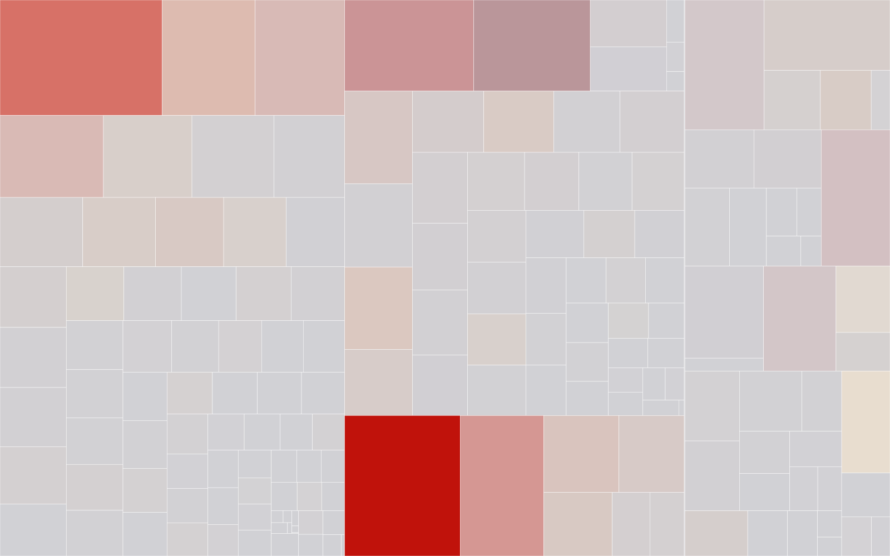
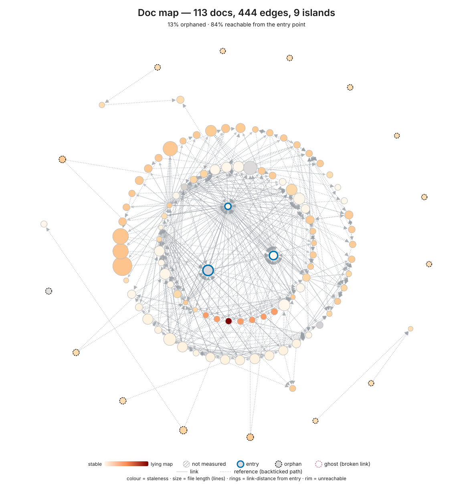

# Codebase Assessment: ai-native-toolkit

_Generated 2026-09-19. Generated by `/assess` v1.87.0._

**Score: 5.5 / 8 - Solid** - a readiness snapshot, not a verdict · Keyhole: 37 structural concerns (12 hidden coupling, 3 lying map, 2 self-referential tests, 12 unactioned intent, 8 accretion ratchet), 3 safe zones.

The structural contracts here are executable and merge-gating: `test_core_does_not_import_orchestrators` and the plugin contract suite run in required jobs, link integrity is tested rather than hoped for, and the four `# noqa: C901` waivers each state a ccn that ruff still measures exactly (21, 19, 18, 17). The weaker half is what the repo says about its own gates: branch protection requires six checks while `CLAUDE.md` names four, the `ruff + mypy gates` job is not among the six, and nothing measures coverage. The next step is the human read of `scripts/floor_anchor.py`'s tests, which arrived in the same commit as the code they check.

_Note: Mutation testing was not run. Layer 6 (Coverage) is capped at Partial and truth-pressure remains unproven._

> **Agents start here.** The prioritized Top 3 actions below are also machine-readable in `.assess/actions.json` (schema v2: every entry carries `rank`, `action`, `done_when`, and `scope_fence`, plus the lifecycle fields `status` / `claimed_by` / `completed_sha` and a derived execution `mode`). Read that file to pick up the work - even with a smaller model - without parsing this report's prose.

## Top 3 Actions

All three rows are the deterministic core's prescribed attention paths (`scripts/floor_anchor.py`, `skills/assess/scripts/lib/doc_graph.py`, `skills/assess/scripts/lib/README.md`), so no slot was left for the coverage gap; it leads Additional Opportunities.

| # | Action | Layer | Effort | Command / First Step | Done when | Scope fence | Hotspot files this addresses | Issue |
|---|--------|-------|--------|---------------------|-----------|-------------|------------------------------|-------|
| 1 | Request human review of `scripts/tests/test_floor_anchor.py`: the tests and `scripts/floor_anchor.py` were added in the same commit (`cfbae30`), so they may pin the author's model rather than the clauses in `FLOOR.md`. Record which `FLOOR.md` clause each test group pins, and list clauses with no test. | 6 | medium | Read `FLOOR.md` beside `scripts/tests/test_floor_anchor.py`; write the clause-to-test map into the review record of the next floor-core pull request | Every `FLOOR.md` clause that `floor_anchor.py` enforces names at least one test, or is listed as unpinned; `cd scripts && uv run --with pytest pytest -q tests/test_floor_anchor.py` passes | Review and tests only; no behaviour change to `scripts/floor_anchor.py`. Floor-core edits need the maintainer's sign-off, so batch the line-280 `# noqa: S310` reason fix into a floor-core pull request that is already planned | `scripts/floor_anchor.py` (646 LOC, +1,067 net lines over 7 commits, 11.8% deletions), `scripts/floor_check.py` | #410 |
| 2 | Action the three stale suppressions in `skills/assess/scripts/lib/doc_graph.py` (line 43 `# type: ignore[assignment]`, line 46 `# noqa: E402`, line 403 `# noqa: F401`; the oldest survived 15 edits): give each a reason in the `# noqa: X  # reason` form, or remove the need for it. | 3 | small | `rg -n "noqa\|type: ignore" skills/assess/scripts/lib/doc_graph.py` | A re-run of `/assess` drops `doc_graph.py` from `unactioned_intent`; `cd skills/assess && uvx ruff check . && uv run --with mypy mypy` pass with no new suppressions | The three comment lines only; leave `build_doc_graph` and its `# noqa: C901` waiver for the separate decomposition listed under Additional Opportunities | `skills/assess/scripts/lib/doc_graph.py` (851 LOC, +1,323 net lines over 16 commits, 4.9% deletions) | #411 |
| 3 | Fix `skills/assess/scripts/lib/README.md`, the per-module reference: it omits 2 of the 44 modules on disk (`decline_markers.py`, `interactivity.py`). Add an entry for each. Its two `unactioned_intent` hits (lines 280 and 532) are prose describing the marker scanner, not promises; reword them so the word pair TODO/FIXME is not read as a marker, or teach the scanner to skip prose. | 0 | small | `cd skills/assess/scripts/lib && for f in *.py; do rg -q -F "$f" README.md \|\| echo "$f"; done` | That loop prints only `__init__.py`; a re-run of `/assess` drops the file from `lying_map` and `unactioned_intent` | `README.md` only, plus `promissory_markers.py` if the scanner route is chosen (with a test beside it); no module renames | `skills/assess/scripts/lib/README.md` | #412 |

### Why these three?

Action 1 is the only one that needs a person: the floor is the repo's tamper-evidence, and a suite written with its subject proves consistency, not correctness (Feathers' characterization tests pin what the code does; only a reader holding `FLOOR.md` can say whether that is what it should do). Actions 2 and 3 are the tool's own write-side tendencies showing up in its core: suppressions that outlived 14-15 edits without a recorded reason, and a module reference that fell two modules behind the directory it indexes while being edited 51 times in the window.

## Snapshots

### Complexity - riskiest to change

Five of the six top hotspots are in `skills/assess/`: the engine auditing itself. Per-function ccn p95 is 8; the ruff gate holds at 15 with `build_run_context` sitting exactly on it.

### Doc navigability - can an agent find its way?

84% of 113 docs are reachable from the entry points (75% by links alone); the gap is wayfinding, and no stale hub clears the confidence bar to be called a lying map.

📈 Snapshot detail (commit, hotspots, navigability, lying maps)

#### Complexity profile

- **Measured at commit:** `4890b692f6eb` (2026-09-19) - **working tree had uncommitted changes; figures include un-committed edits**. The only modified paths were this run's own `.assess/` outputs, written by the treemap before the core sampled `git status`; no source file differed from the commit.
- **Files scored:** 168 (164 lizard, 4 scc)
- **Churn window chosen:** last 12mo
- **Complexity profile:** per-function ccn p95 8 (max 51); file-aggregate ccn p95 155 (max 291); p95 est. tokens 12,330 (max 25,117; code 25,117, data 1,572); p95 LOC 736 (max 1,644; code 1,644, data 78)
- **Top hotspots** (composite `sqrt(ccn) × sqrt(1 + commits) × sqrt(est_tokens)`; `ccn` is the file aggregate, worst single function in parentheses):
  1. `skills/assess/scripts/assess_core.py` - 21,763 est. tokens (1,020 LOC), aggregate ccn 234 (worst function `build_run_context` 51), 57 commits in window
  2. `skills/assess/tests/test_assess_core.py` - 25,117 est. tokens (1,644 LOC), aggregate ccn 200 (worst function `test_pruned_finding_paths_block_after_rename_and_delete` 16), 36 commits
  3. `skills/assess/scripts/complexity-treemap.py` - 15,730 est. tokens (788 LOC), aggregate ccn 199 (worst function `write_stats` 40), 22 commits
  4. `skills/assess/scripts/lib/doc_graph.py` - 14,245 est. tokens (851 LOC), aggregate ccn 291 (worst function `build_doc_graph` 44), 16 commits
  5. `skills/assess/scripts/lib/keyhole_signals.py` - 15,755 est. tokens (759 LOC), aggregate ccn 233 (worst function `integrate` 30), 18 commits
- **Two complexity readings, both stated.** The per-function figures above are lizard's. Ruff's mccabe rule, the one CI runs, reads the same functions lower: `build_run_context` 15, `write_stats` 13, `integrate` 11, `build_doc_graph` 21 (waived). Lizard counts boolean operators and nested callables that mccabe does not. The gate is not eroded; it measures a narrower thing than the heatmap shows.
- **Keyhole budget:** the repo is ~663,341 est. tokens; no file exceeds the ~200k keyhole budget (an estimate at ~4 chars/token) and 1 subtree does: `skills` (~510,437).

Size encodes estimated tokens (~chars/4 - the keyhole size unit; the familiar LOC is one hover away in the tooltip), colour encodes cyclomatic complexity (dark red = high), saturation encodes recent git churn (vivid = active). Vivid red blocks are the migration risk.

_No hatching visible - mutation analysis was not run. The hatching would mark covered-but-unpinned code (tests that execute without constraining). Run `/assess` and accept the mutation offer to enable it._

The mutation offer **was** accepted on this run and the pass still did not run. `run_bounded_mutation` in `skills/assess/scripts/lib/test_pressure/mutation.py` invokes bare `mutmut run`; the installed mutmut 3.6.0 exits 1 with "Could not figure out where the code to mutate is" because no `source_paths` is configured, and 3.x has no `junitxml` subcommand for the follow-up call. `run-context.json` records `mutation_note: "no mutant records recovered from mutmut output (exit code 1)"`. No source file was modified.

#### Where to focus testing

Coverage data: none found - test signals are heuristic-only.

| File | Risk | Test Signal | Suggested Action |
|------|------|-------------|------------------|
| `skills/assess/scripts/assess_core.py` | High | Test file present, coverage unmeasured | Measure coverage |
| `skills/assess/tests/test_assess_core.py` | High | Test file present, coverage unmeasured | Measure coverage |
| `skills/assess/scripts/complexity-treemap.py` | High | Test file present, coverage unmeasured | Measure coverage |
| `skills/assess/scripts/lib/doc_graph.py` | Medium | Test file present, coverage unmeasured | Measure coverage |
| `skills/assess/scripts/lib/keyhole_signals.py` | Medium | Test file present, coverage unmeasured | Measure coverage |
| `skills/assess/tests/test_keyhole_signals.py` | Medium | Test file present, coverage unmeasured | Measure coverage |
| `skills/assess/scripts/doc-graph-svg.py` | Medium | Test file present, coverage unmeasured | Measure coverage |
| `scripts/floor_anchor.py` | Low | Test file present, coverage unmeasured | Measure coverage |
| `skills/assess/scripts/lib/doc_staleness.py` | Low | Test file present, coverage unmeasured | Measure coverage |
| `skills/assess/tests/test_complexity_treemap.py` | Low | Test file present, coverage unmeasured | Measure coverage |

Two of the ten rows are test files listed as subjects needing tests, which is noise in the focus list rather than a testing gap.

#### Doc navigability

Of 113 docs, 84% are reachable from `CLAUDE.md`, `README.md` or `docs/index.md` by following links and backticked doc paths; 13% are orphans (nothing links to or cites them) and the set splits into 9 disconnected islands. By links alone the figures are 75% reachable and 25% orphaned, so roughly a tenth of the wayfinding rests on backticked citations rather than links. Orphans include `skills/assess/references/uninstall.md`, `skills/assess/tests/README.md` and `scripts/contract/readiness_check_prompt.md`. There are 0 broken links. This is a curation gap, not an access gap: an agent can still open any file by path, and linking the orphans from `docs/index.md` is the fix.

**Lying maps.** Stale = days since a doc's last content change; subject churn = commits in the window to the code the doc describes; centrality = how many other docs point to it. No bulk commits were skipped and the history scan was complete. The three top stale hubs (`skills/ab-equivalence/references/ab-equivalence.md` 107 days, `skills/skill-forge/references/panel-ledger.md` 106 days, `skills/ab-equivalence/references/runner-prompt.md` 86 days) are all `repo-baseline` associations at low confidence: their "subject churn" is the whole repo's, so none is called a lying map here. The three `lying_map` finding paths (`README.md`, `skills/assess/scripts/lib/README.md`, `skills/assess/tests/README.md`) were each changed on the measured date; the ratio flags them because the code beside them moves faster, not because they are frozen. A direct count found one real gap among them: `lib/README.md` omits two modules (Action 3).

Colour = staleness (vivid red = a frozen doc beside churning code = a lying map); structure = reachability (centre = entry, rim = unreachable, dashed ring = orphan; a solid edge is a link, a dotted edge a reference - a backticked path to an existing doc); size = file length. Hover a node in the SVG (opened on its own) for its path and stats.

#### What changed since last run

_Diff suppressed: schema version changed None->5._ The prior report (v1.46.2, 2026-06-19) read 8.0 / 8. That figure came from an older methodology with no evidence check and is not comparable to this one; the drop is not a measured regression.

📊 Full scorecard (per-layer evidence & gaps)

The two headline metrics measure **different things and are never combined.** The 0-8 score answers _"is the scaffolding in place to catch problems?"_ The Keyhole Readiness summary answers _"where is today's structural pain?"_ - a count of structural concerns and safe zones rolled up from the ten cross-layer findings. Report both; never average one into the other.

All 50 evidence entries the scorer offered were re-checked against the repository by `lib/evidence_check.py`: verified 50, rejected 0. Branch-protection facts come from the GitHub API, not disk, and carry no evidence entry.

| Layer | What it asks | Band | Status | Evidence | Gap |
|-------|--------------|------|--------|----------|-----|
| 0: Agent Instructions & Navigability | Can I build a true map of this codebase before I touch it? | read | Present | `CLAUDE.md` graded A (85); `docs/index.md` is a wired index; `tests/test_plugin_contract.py` carries `test_internal_links_resolve`; 0 broken links, 0 broken instruction refs | `CLAUDE.md` does not contain "floor enforcement" or `FLOOR.md`, though `FLOOR.md` and `.github/workflows/floor.yml` exist and the floor checks are required; its merge advice names four required checks of six |
| 1: Runtime Legibility / Liveness | Can I see which parts are live, which need attention, and which are dead weight? | read | Missing | Observability rung 0; `.mcp.json` and `OBSERVABILITY.md` absent; `CLAUDE.md` states "There is no application runtime". Liveness is read through complexity, churn and reachability: vulture ran and found 0 dead-code candidates (intra-repo only) | Which skills are used in the field is known only to the maintainer; JavaScript liveness (`scripts/canaries/drive_interactive.mjs`) is unserved - `knip` would provide it |
| 2: Code Design | Will the type-checker catch my mistakes? | write | Partial | `skills/assess/pyproject.toml` has `[tool.mypy]` scoped to `scripts/lib` and `scripts/assess_core.py`; `.github/workflows/tests.yml` runs mypy | No `strict = true` or `disallow_untyped_defs`; `scripts/pyproject.toml` has no mypy config, so `floor_check.py`, `floor_anchor.py` and `transform_skill.py` are unchecked; the job is not a required check |
| 3: Linters | Are complexity and style bounds enforced, or will my code drift? | write | Partial | `max-complexity = 15` in both `pyproject.toml` files; `.github/workflows/tests.yml` runs `ruff check`; waivers are explicit and accurate | The lint job is not merge-gating; no file-length rule while the largest file is 1,644 LOC; 16 stale suppressions, the oldest (`assess_core.py`, `# noqa: BLE001`) survived 36 edits |
| 4: Architecture Tests | Are the structural conventions executable, or just folklore? | write | Present | `skills/assess/tests/test_self_architecture.py` (`test_core_does_not_import_orchestrators`); `tests/test_plugin_contract.py` enforces naming; both run in required jobs | One import rule; no size ratchet, while 8 files show monotonic growth |
| 5: CI Pipeline | Does something automatically catch a bad change before it merges? | write | Partial | `.github/workflows/tests.yml` runs on `pull_request:`; `.github/workflows/assess-gate.yml` exists; six required checks with admin enforcement | No `--cov` and no `codeql` anywhere under `.github/workflows`; lint and type job advisory; required checks not strict against base |
| 6: Coverage Gates | Do the tests constrain behaviour, or just execute lines? | write | Missing | `codecov.yml` and `.coveragerc` absent; no `--cov` or `mutmut` under `.github/workflows`; no `mutmut` in `skills/assess/pyproject.toml`; `CLAUDE.md` says "No coverage gates". truth-pressure unproven (mutation not run) | The Partial cap is a ceiling; with no coverage configuration at all, the evidence matches Missing |
| 7: Code Review Bots | Is there design-level feedback on every change? | write | Present | `.github/workflows/claude-review.yml` runs `anthropics/claude-code-action` against `.github/claude-review-instructions.md`, whose focus list includes "Deterministic-core boundary"; all 30 sampled merged pull requests carried a bot review | Advisory only: 100% self-merged, 67% approved by someone other than the author, no approval required; `.coderabbit.yaml` absent |
| 8: AI Project Mgmt (capstone) | Do learnings feed back into the contracts, or evaporate? | meta | Present | `CLAUDE.md` has `## Marathon Configuration` and the `agent-ready` label; `skills/marathon/SKILL.md` exists; incidents #211/#216 are cited in `CLAUDE.md` and paired with `test_no_conflict_markers` | The retro log (`marathon-retros.md`) lives at a per-machine path, so the feedback record reaches no clone; `.taskmaster` and `.claude/settings.json` absent |

### Score derivation (worked)

Present = 1, Partial = 0.5, Missing = 0. Four Present (L0, L4, L7, L8) + three Partial (L2, L3, L5) + two Missing (L1, L6) = 4.0 + 1.5 = 5.5 raw; `min(5.5, 8)` = **5.5 / 8**, fraction 0.6875 = **Solid**. Archetype: software, denominator 8.

### Maturity Level

| Score | Level | Description |
|-------|-------|-------------|
| 0-2 | Not Ready | Agent will produce inconsistent, unvalidated code |
| 3-4 | Basic | Norms exist but aren't enforced. Agent works but drifts |
| 5-6 | Solid | Contracts catch most issues. Agent is productive |
| 7-8 | AI-Native | System self-improves. Agents work reliably at scale |

### What this score unlocks

The maturity band bounds how much agent **autonomy** this repo's contracts can safely absorb, in the vocabulary of the adoption ladder ([Steps of AI Adoption](https://www.threads.com/@boris_cherny/post/Da4CkQnEea-), B. Cherny, 2026).

| Band | Contracts support up to | Why |
|------|------------------------|-----|
| Not Ready | Step 1 (Assisted) - one supervised agent | No verification contracts; a human must review every change |
| Basic | Step 1-2 boundary | Parallel agents are risky until L5/L6 self-verification holds |
| Solid | Step 2 (Parallel) - ~10 agents, one orchestrator | Self-verification and review automation absorb parallel diffs |
| AI-Native | Step 3 (Supervised autonomy) - background routines | Contracts plus L8 orchestration can absorb autonomous loops |

**This is a bound, not a claim about how the team actually works.**

🔎 Cross-layer findings & lying signals (keyhole detail)

No Lying Signals row met its threshold on this run: every stale hub is low-confidence, `instruction_claims.failed` is 0, the dead-code scan returned 0 candidates, `config_drift` has no entries, no mutation data exists, and review is not required so neither review flag fired. One mismatch sits outside those detectors: `CLAUDE.md` tells an agent to merge "once the four named required checks are green" while branch protection lists six (the four, plus `floor enforcement` and `floor self-anchor`). It fails loudly - GitHub refuses the merge - so it misleads for minutes, not silently.

## Cross-Layer Findings (Keyhole Readiness)

### hidden_coupling

Action: investigate the seam

Paths:
- scripts
- scripts/contract
- scripts/tests
- skills
- skills/assess
- skills/assess/scripts
- skills/assess/scripts/lib
- skills/assess/tests
- skills/assess/tests/fixtures
- skills/skill-forge

### lying_map

Action: fix or delete the doc

Paths:
- README.md
- skills/assess/scripts/lib/README.md
- skills/assess/tests/README.md

### self_referential_tests

Action: request human review - tests verify internal consistency, not truth

Paths:
- scripts/floor_anchor.py
- scripts/floor_check.py

### unactioned_intent

Action: action the promise: fix it, ticket it, or delete the marker/skip (stale: an untracked marker that survived 5 or more edits to its own file)

Paths:
- CLAUDE.md
- agents/assess-layer-scorer.md
- scripts/floor_anchor.py
- skills/assess/SKILL.md
- skills/assess/scripts/assess_core.py
- skills/assess/scripts/complexity-treemap.py
- skills/assess/scripts/doc-graph-svg.py
- skills/assess/scripts/lib/README.md
- skills/assess/scripts/lib/doc_graph.py
- skills/assess/scripts/lib/keyhole_signals.py

### accretion_ratchet

Action: refactor down: extract, delete dead code, or split the file

Paths:
- scripts/floor_anchor.py
- scripts/floor_check.py
- scripts/tests/test_floor_anchor.py
- scripts/tests/test_floor_check.py
- skills/assess/scripts/lib/doc_graph.py
- skills/assess/tests/test_assess_finalize.py
- skills/assess/tests/test_complexity_treemap.py
- skills/assess/tests/test_keyhole_signals.py

### refactor_boundary

Action: safe to hand an agent in isolation

Paths:
- commands
- docs/design
- docs/design/2026-09-modernization

### Attention List (Priority Order)

- scripts/floor_anchor.py (score 3): accretion_ratchet, self_referential_tests, unactioned_intent
- skills/assess/scripts/lib/doc_graph.py (score 2): accretion_ratchet, unactioned_intent
- skills/assess/scripts/lib/README.md (score 2): lying_map, unactioned_intent
- scripts/floor_check.py (score 2): accretion_ratchet, self_referential_tests
- skills/assess/scripts/assess_core.py (score 1): unactioned_intent

✅ Strengths & further opportunities

### Strengths

- Structure is executable: `skills/assess/tests/test_self_architecture.py` derives its forbidden-import set from disk, and `tests/test_plugin_contract.py` tests link resolution, naming and conflict markers in a required job.
- The complexity gate is honest: `max-complexity = 15` with four explicit waivers whose stated values match what ruff measures today.
- Incidents become contracts: `CLAUDE.md` cites #211/#216 beside `test_no_conflict_markers`, the pattern Layer 8 looks for.
- Every sampled merged pull request carried an automated design review driven by `.github/claude-review-instructions.md`.
- Safe zones for isolated agent work (`refactor_boundary`): `commands`, `docs/design`, `docs/design/2026-09-modernization`.

### Additional Opportunities

- Generate a line-coverage report (`coverage.xml`) in CI and read it for `skills/assess/scripts/assess_core.py`, `skills/assess/tests/test_assess_core.py` and `skills/assess/scripts/complexity-treemap.py` first (the deterministic `gap_actions` entry; no Top 3 slot was free).
- Fix the opt-in mutation pass for mutmut 3.x: `run_bounded_mutation` calls bare `mutmut run` and `mutmut junitxml`; 3.x needs `source_paths` and has no `junitxml`. Until then Layer 6 cannot rise above its cap on any Python repo with a current mutmut. Tracked in #413.
- `measured_commit.dirty` (`lib/git_churn.py`) counts the run's own tracked `.assess/` outputs, so every repeat run on a repo that commits `.assess/` reports uncommitted changes. Exclude `.assess/` from that status call. Tracked in #414.
- The marker scanner reads prose about TODO markers as TODO markers (`lib/README.md:532`, `assess_core.py:1118`), and does not credit single-dash suppression reasons (`# noqa: BLE001 - intentional catch-all`). Tracked in #415.
- Add `floor enforcement`, `floor self-anchor` and `FLOOR.md` to `CLAUDE.md`'s CI section, and correct "the four named required checks" to six.
- Decide whether `ruff + mypy gates` should be a required check; today a type or lint failure does not block a merge.
- Decompose `build_doc_graph` (mccabe 21, waived as a ratchet target; the file grew 1,323 net lines with 4.9% deletions) behind its existing tests, then remove the waiver.
- Link the orphan docs (`skills/assess/references/uninstall.md`, `skills/assess/tests/README.md`, `scripts/contract/readiness_check_prompt.md`) from `docs/index.md`.
- Under the cap, watch: `build_run_context` sits at mccabe 15 of 15. Not a violation; the next branch added to it fails the gate.

🧭 How to read this report (framing & method)

**What this is ultimately measuring.** When you hand work to an AI here, does it behave like a brand-new hire or like an engineer who has been in the org eighteen months? The difference is *externalized context*: knowing where things live, which contracts are load-bearing, where the minefields are. An AI contributor starts every session with an empty head and one narrow context window, so this report scores how much of the tenured engineer's map the codebase has made explicit and navigable. **Legibility you can trust, not omniscience you can't.** The write-side layers read not as a leash on the agent but as the guardrails that protect any contributor from costly mistakes by design. A **Missing** there means the codebase asks the contributor to be careful where it could instead make the wrong move hard to make.

This is an improvement roadmap, not a verdict. It measures one thing: **is the codebase kept honest, not just scaffolded.** It pairs three views: the complexity heatmap (where the codebase is today), the doc graph (whether an agent can navigate it), and the 0-8 score (what keeps it from getting worse) across read-side, write-side and meta bands. A codebase can be 8/8 and still on fire, or 2/8 with a calm treemap.

**Each layer is a sense the agent needs, not a box to tick.** A Missing or Partial locates where someone working here is partly blind, and the Gap column says what would restore the view. **Layer 1 (Runtime Legibility) is the agent's attention-sense.** A repo with no deployed runtime answers it through complexity, churn and reachability, so the heatmap and the dead-code scan *are* its observability; a low score there means look through those instruments.

**The legacy-transition lens.** "Legacy code is code without tests" (Feathers, *Working Effectively with Legacy Code*, 2004): characterize current behaviour, find a seam, then refactor. Don't rewrite - strangle (Spolsky 2000; Fowler's Strangler Fig). Hotspots and change-coupling are the map (Tornhill). Decide per component (the 7 Rs).

**How it's measured.** Static analysis, git history and graph metrics over the docs and code. The model writes the prose around those numbers and does no scanning itself, which keeps the structural findings reproducible run to run.

🤖 Machine-readable data (for agents)

If you are an agent working in this repo, the `.assess/` directory is actionable feedback written for you:

- `.assess/assess-report.md` - this report: the scorecard, the lying signals, and the Top 3 Actions with exact commands and file paths.
- `.assess/run-context.json` - the full data bus (findings, attention, keyhole summary, prescribed actions, stats, diff).
- `.assess/complexity-stats.json` - complexity / estimated-token / LOC percentiles, the keyhole-budget rollup (`est_tokens.budget`), plus the ranked file lists (`top_hotspots`, `top_complex`, `top_large`).
- `.assess/hotspots/<file>.md` - per-file briefings, each with a **Suggested actions** section. Read a file's briefing before you change it.
- `.assess/index.md` - the catalog of every hotspot ever flagged (current and graduated).
- `.assess/log.md` - append-only run history, so a hotspot's trajectory is visible across runs.

---

_Report generated by [`/ai-native-toolkit:assess`](https://github.com/bjcoombs/ai-native-toolkit). Install in any Claude Code session: `/plugin marketplace add https://github.com/bjcoombs/ai-native-toolkit` then `/plugin install ai-native-toolkit@ai-native-toolkit`._
