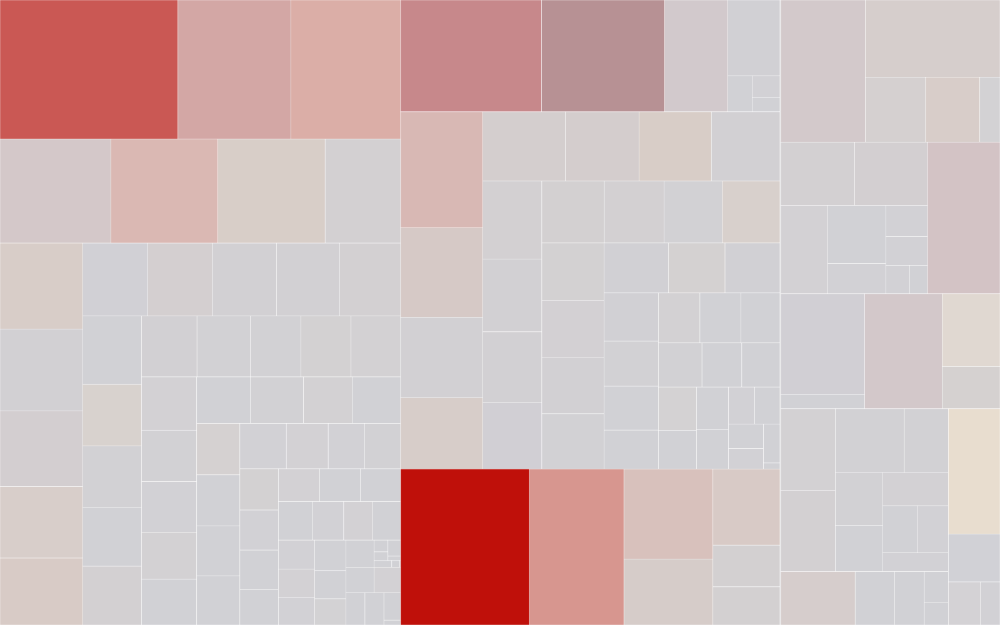
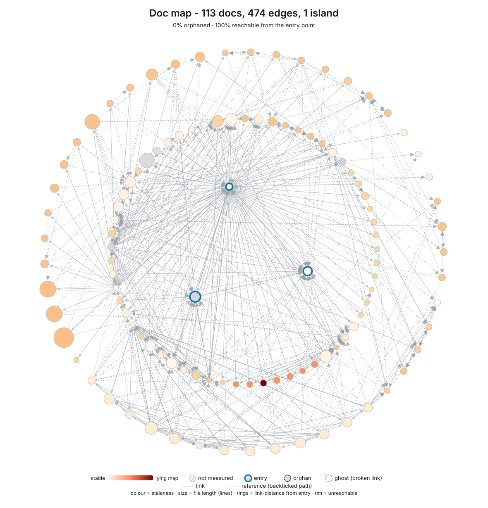

# Codebase Assessment: ai-native-toolkit

_Generated 2026-10-08 by `/assess` 1.95.0 (`main` 08735da with #503-#509, plus this branch's version bump), measuring `0bd9b71`: `main` plus the dangling-link fix in this assessment's branch._

**Score: 7.5 / 8 - AI-Native** - a readiness snapshot, not a verdict · Keyhole: 24 structural concerns (12 hidden coupling, 1 untrusted hotspot, 2 self-referential tests, 9 accretion ratchet), 3 safe zones.

The plugin now has the layout Claude Code documents. The seven slash workflows moved from the legacy `commands/` directory to user-invoked skills with unchanged names (#505); the agent catalog stopped loading as a bogus `README` agent (#507); every agent uses a documented colour, and a contract test keeps it that way (#503). `/assess` can now see this class of problem in any repo: its `claude_config` scan (#506) flagged all of it on the old tree and reports nothing today. The project also has a front door at https://bjcoombs.github.io/ai-native-toolkit/ (#504).

The score holds at 7.5. One figure fell because it was corrected, not because anything got worse: `base_doc_dir_ratio` used to count READMEs in directories with no code, and the honest reading is 0.154 (#508). The last half point is still Layer 6, `scripts/floor_anchor.py`, which waits on the maintainer's floor decision in #410.

> **Agents start here.** The prioritized Top 3 actions below are also machine-readable in `.assess/actions.json` (schema v2: every entry carries `rank`, `action`, `done_when`, and `scope_fence`, plus the lifecycle fields `status` / `claimed_by` / `completed_sha` and a derived execution `mode`). Read that file to pick up the work - even with a smaller model - without parsing this report's prose.

## Top 3 Actions

All three are the prescribed attention rows, unchanged from #499: the two floor scripts with same-commit tests, then the test file that only ever grows. Action 1 is the only path to Layer 6 Present.

| # | Action | Layer | Effort | Command / First Step | Done when | Scope fence | Hotspot files this addresses | Issue |
|---|--------|-------|--------|---------------------|-----------|-------------|------------------------------|-------|
| 1 | Strengthen `scripts/floor_anchor.py`'s tests to pin observable behaviour, written from FLOOR.md's clause text, once the #410 decision on clause iii is made | 6 | medium | Read the review comment on #410; decide whether `floor_core_changed` widens to all seven clause-iii paths or the clause narrows to four; then write one test per clause | `floor_anchor.py`'s survivor density in the opt-in mutation pass falls below 0.3 (437 of 1,017 today), and a change under `scripts/contract/` requests `floor-signoff` or clause iii no longer lists it | Floor files: any change needs the maintainer's out-of-band `floor-signoff` approval; no agent self-applies it | `scripts/floor_anchor.py` | #410 |
| 2 | Add the clause-integrity and token-floor tests for `floor_check.py` from the #410 review (tests 2-4), written independently of `REQUIRED_CLAUSES` and `MINIMUM_TOKEN_COUNT` | 4 | medium | Write each test from FLOOR.md's sentence, not from the constants | Deleting a `REQUIRED_CLAUSES` entry or lowering `MINIMUM_TOKEN_COUNT` turns a test red | Same floor sign-off rule as Action 1; tests only, no change to the checker's behaviour | `scripts/floor_check.py` | #410 |
| 3 | Split `skills/assess/tests/test_complexity_treemap.py` (`accretion_ratchet`; 1,798 lines, held at its `.file-size-ratchet.toml` ceiling) by concern, moving tests unchanged | 3 | medium | Group its tests by the treemap stage they exercise (scoring backends, stats sidecar, layout, render) into `test_complexity_treemap_<stage>.py` files, as #478 split the keyhole tests | Every new file is under 800 lines, the file's `.file-size-ratchet.toml` ceiling is deleted, and the collected test names and the treemap's line coverage are identical before and after | Move tests only; no assertion or fixture logic changes | `skills/assess/tests/test_complexity_treemap.py` | - |

The top rows score 3 and 2, so the ranking separates them. No gap action is pending.

### Why these three?

The floor is the repo's constitutional gate, and its anchor checker is the one file the mutation pass proves hollow. Both floor actions wait on the maintainer, and Action 1 is the one that moves Layer 6. Action 3 retires the largest remaining test-file ceiling; since #498 the ratchet follows a file down, so lines a split removes can come back only through a ceiling raise someone reviews.

## Snapshots

### Complexity - riskiest to change

The risk sits in `skills/assess/`, and no function in the top hotspots exceeds ccn 15. `floor_anchor.py` carries the survivor hatching.

### Doc navigability - can an agent find its way?

Every doc is reachable from an entry point, with no orphans, one island, no broken links and no lying maps.

📈 Snapshot detail (commit, hotspots, navigability, lying maps)

#### Complexity profile

- **Measured at commit:** `0bd9b71` (2026-10-08)
- **Files scored:** 224
- **Churn window chosen:** last 12mo
- **Complexity profile:** per-function ccn p95 8 (max 33, `authorship_analysis` in `lib/change_coupling.py`, under an explicit `# noqa: C901` with a reason; ruff's mccabe scores it 19); file-aggregate ccn p95 147 (max 247); p95 est. tokens 9,648 (max 19,417); p95 NLOC 570 (max 1,227)
- **Top hotspots** (composite `sqrt(ccn) × sqrt(1 + commits) × sqrt(est_tokens)`). Sizes are NLOC (code lines); `ccn` is the **file aggregate**, with the worst single function in parentheses:
  1. `skills/assess/scripts/complexity-treemap.py` - 17,610 est. tokens (847 NLOC), aggregate ccn 214 (worst function `lizard_scores` 14), 33 commits in window
  2. `skills/assess/scripts/lib/keyhole_signals.py` - 17,957 est. tokens (860 NLOC), aggregate ccn 247 (worst function `render_findings_markdown` 11), 26 commits in window
  3. `skills/assess/scripts/assess_core.py` - 9,247 est. tokens (397 NLOC), aggregate ccn 26 (worst function `build_run_context` 13), 69 commits in window
  4. `skills/assess/scripts/lib/doc_graph.py` - 12,110 est. tokens (705 NLOC), aggregate ccn 209 (worst function `_derive_signals` 15), 23 commits in window
  5. `skills/assess/tests/test_complexity_treemap.py` - 19,417 est. tokens (1,227 NLOC), aggregate ccn 189 (worst function `test_write_stats_tie_break_by_path_takes_first_ten_in_path_order` 6), 25 commits in window
- **Keyhole budget:** the repo is ~822k est. tokens. No single file exceeds the ~200k keyhole budget; 1 subtree does: `skills`.

Size encodes estimated tokens, colour cyclomatic complexity, saturation recent churn.

**Hatching:** the opt-in mutation pass ran, and both groups produced records through the `uv` runner. `scripts/floor_anchor.py` (437 of 1,017 survive, density 0.43) is hatched; `skills/assess/scripts/lib/doc_graph.py` (305 of 1,315, density 0.23) is not. The pass mutates only focus files, so `keyhole_signals.py` and `mutmut3.py` have no figure here; the weekly CI run covers `keyhole_signals.py`.

#### Where to focus testing

Coverage data: `coverage.xml` (Cobertura)

Coverage gate: `scripts/pyproject.toml:41` (`[tool.coverage.report] fail_under` 91); `skills/assess/pyproject.toml:38` (`[tool.coverage.report] fail_under` 93)

| File | Risk | Test Signal | Suggested Action |
|------|------|-------------|------------------|
| `skills/assess/scripts/lib/doc_graph.py` | Medium | Covered but hollow | Strengthen assertions |
| `skills/assess/tests/test_complexity_treemap.py` | Medium | Test file present, coverage unmeasured | Measure coverage |
| `skills/assess/tests/test_assess_core.py` | Medium | Test file present, coverage unmeasured | Measure coverage |
| `scripts/floor_anchor.py` | Low | Covered but hollow | Strengthen assertions |

The test files show as unmeasured because coverage measures source, not the tests themselves. The mutation pass confirms `floor_anchor.py` as hollow (the `untrusted_hotspot` finding) and puts `doc_graph.py` under the hollow threshold.

#### Doc navigability

Of 111 docs, all are reachable from `CLAUDE.md`, `README.md` or `docs/index.md` by links and backticked doc paths, with no orphans, one connected island and no broken links. Links alone reach 93%; backticked citations carry the rest. The first pass of this run found one broken link, `docs/superpowers/README.md` pointing at the `commands/README.md` that #505 removed; it is fixed in 0bd9b71. The plugin contract suite's link check covers shipped skill files, not `docs/`, which is why #505 did not catch it.

**Base docs per code directory:** 2 of 13 code-containing directories hold their own base doc (`skills/assess/scripts/lib/`, `skills/assess/tests/`), a ratio of 0.154. The figure read 0.769 before #508 because READMEs in directories with no code (the root, `docs/`, `agents/`, `skills/`) counted. Undocumented code directories include `scripts/`, `scripts/contract/`, `scripts/canaries/`, `skills/assess/scripts/` and `lib/test_pressure/`; `CLAUDE.md` covers them in prose, so an agent still reaches them through one hub.

**Lying maps:** none. The top stale hubs (`FLOOR.md`, `docs/floor-anchor-proof.md`) are matched only against whole-repo churn (low confidence).

#### What changed since last run

- **Graduated, regressed, restructured, new:** none.
- **Persistent:** the same ten top hotspots as #499.

📊 Full scorecard (per-layer evidence & gaps)

The two headline metrics measure different things and are never combined: the 0-8 score asks whether the scaffolding catches problems; the Keyhole summary counts today's structural pain.

| Layer | What it asks | Band | Status | Evidence | Gap |
|-------|--------------|------|--------|----------|-----|
| 0: Agent Instructions & Navigability | Can I build a true map of this codebase before I touch it? | read | Present | `CLAUDE.md` (grade A, claims 2 of 2 verified); base docs at `skills/assess/scripts/lib/README.md` and `skills/assess/tests/README.md`; 100% reachable, 0 orphans, 0 broken links; `claude_config` 0 findings over 27 files; `commands/README.md` gone | No `scripts/README.md`: 11 of 13 code dirs rely on `CLAUDE.md` alone (ratio 0.154), so Layer 0 rests on one hub staying accurate |
| 1: Runtime Legibility / Liveness | Can I see which parts are live, which need attention, and which are dead weight? | read | Missing | No `OBSERVABILITY.md`, no `.mcp.json`. There is no deployed runtime, so liveness is read through complexity, churn and reachability; vulture found 0 dead-code candidates | No runtime by design; the JS canaries are unscanned (knip not installed) |
| 2: Code Design | Will the type-checker catch my mistakes? | write | Present | `strict = true` in `skills/assess/pyproject.toml` with `disallow_any_generics` and no per-module exceptions; `mypy` in `.github/workflows/tests.yml` | `scripts/` floor overrides remain (`floor_anchor`, `floor_check.py` need floor sign-off; `start_gate`, `run_canaries` need only the canary suite) |
| 3: Linters | Are complexity and style bounds enforced, or will my code drift? | write | Present | ruff `C901` with `max-complexity = 15` in both `pyproject.toml` files, run by `ruff check` in `.github/workflows/tests.yml`; `.file-size-ratchet.toml` (`default_limit = 800`); 0 stale of 78 suppressions | Lizard scores some functions above 15 that ruff's mccabe passes (e.g. `floor_check.cmd_markers` 22) |
| 4: Architecture Tests | Are the structural conventions executable, or just folklore? | write | Present | `skills/assess/tests/test_self_architecture.py`; `tests/test_file_size_ratchet.py`; plugin contract tests now cover skill and agent frontmatter, no legacy `commands/`, documented colours and the `$0` guard | One import rule |
| 5: CI Pipeline | Does something automatically catch a bad change before it merges? | write | Present | `.github/workflows/tests.yml` (`pytest` suites) and `.github/workflows/floor.yml` under seven required checks | CodeQL and pip-audit are advisory; claude-review cannot review a PR that edits its own workflow (#509) |
| 6: Coverage Gates | Do the tests constrain behaviour, or just execute lines? | write | Partial | `fail_under = 93` in `skills/assess/pyproject.toml`, `fail_under` 91 in `scripts/pyproject.toml`; `mutmut` weekly in `.github/workflows/mutation.yml`; the opt-in pass ran with no cap | `scripts/floor_anchor.py`: 437 of 1,017 survive (density 0.43); the hottest code has no figure from this pass |
| 7: Code Review Bots | Is there design-level feedback on every change? | write | Present | `.github/workflows/claude-review.yml` with `.github/claude-review-instructions.md`; 93% of 30 merged PRs reviewed by someone other than the author, 63% approved | Review is advisory (solo-maintainer repo) |
| 8: AI Project Mgmt (capstone) | Do learnings feed back into the contracts, or evaporate? | meta | Present | `CLAUDE.md` `## Marathon Configuration`; `skills/marathon/SKILL.md` | Retro log is per-machine; no `.taskmaster/` in the repo; agent_ops all false (neutral) |

### Score derivation (worked)

L0 1 + L1 0 + L2 1 + L3 1 + L4 1 + L5 1 + L6 0.5 + L7 1 + L8 1 = **7.5**, under the cap of 8: 0.94 of 8, AI-Native. Unchanged since #499.

### Maturity Level

| Score | Level | Description |
|-------|-------|-------------|
| 0-2 | Not Ready | Agent will produce inconsistent, unvalidated code |
| 3-4 | Basic | Norms exist but aren't enforced. Agent works but drifts |
| 5-6 | Solid | Contracts catch most issues. Agent is productive |
| 7-8 | AI-Native | System self-improves. Agents work reliably at scale |

### What this score unlocks

The maturity band bounds how much agent **autonomy** this repo's contracts can safely absorb ([Steps of AI Adoption](https://www.threads.com/@boris_cherny/post/Da4CkQnEea-), B. Cherny, 2026).

| Band | Contracts support up to | Why |
|------|------------------------|-----|
| Not Ready | Step 1 (Assisted) - one supervised agent | No verification contracts; a human must review every change |
| Basic | Step 1-2 boundary | Parallel agents are risky until L5/L6 self-verification holds |
| Solid | Step 2 (Parallel) - ~10 agents, one orchestrator | Self-verification and review automation absorb parallel diffs |
| AI-Native | Step 3 (Supervised autonomy) - background routines | Contracts plus L8 orchestration can absorb autonomous loops |

**This is a bound, not a claim about how the team actually works.**

🔎 Cross-layer findings & lying signals (keyhole detail)

### Lying Signals

| Layer | Signal Type | Instance | Why it lies |
|-------|-------------|----------|-------------|
| 6 | Green-but-hollow | `scripts/floor_anchor.py` (coverage 87% vs mutation 57%) | Tests execute 87% of the floor anchor's lines, but 437 of 1,017 mutants survive. The coverage gate reads "tested" while behaviour is unpinned. Across both mutated files the score is 68% (742 of 2,332 survived) |

## Cross-Layer Findings (Keyhole Readiness)

`untrusted_hotspot` names `scripts/floor_anchor.py` on the mutation pass's own evidence (437 of 1,017 mutants survive). There is still no `lying_map` and no `unactioned_intent`. The new `claude_config` scan (#506) checked 27 Claude Code skill and agent files and found nothing: the legacy `commands/` directory, its stray README, `agents/README.md` and `scribe`'s undocumented colour are all gone (#503, #505, #507).

### hidden_coupling

Action: investigate the seam

Paths:
- scripts
- scripts/contract
- scripts/tests
- skills/assess
- skills/assess/scripts
- skills/assess/scripts/lib
- skills/assess/scripts/lib/test_pressure
- skills/assess/tests
- skills/assess/tests/fixtures
- skills/skill-forge
_... 2 more omitted; full list in `.assess/run-context.json` `derived_findings` (`hidden_coupling`) `paths`_

### untrusted_hotspot

Action: strengthen tests to pin observable behaviour (not internal state)

Paths:
- scripts/floor_anchor.py

### self_referential_tests

Action: request human review - tests verify internal consistency, not truth

Paths:
- scripts/floor_anchor.py
- scripts/floor_check.py

### accretion_ratchet

Action: refactor down: extract, delete dead code, or split the file

Paths:
- scripts/floor_anchor.py
- scripts/floor_check.py
- scripts/tests/test_floor_anchor.py
- scripts/tests/test_floor_check.py
- skills/assess/scripts/lib/test_pressure/mutmut3.py
- skills/assess/scripts/lib/wiki_writer.py
- skills/assess/tests/test_assess_finalize.py
- skills/assess/tests/test_complexity_treemap.py
- skills/assess/tests/test_promissory_markers.py

### refactor_boundary

Action: safe to hand an agent in isolation

Paths:
- docs/design
- docs/design/2026-09-modernization
- skills/tm

### Attention List (Priority Order)

- scripts/floor_anchor.py (score 3): accretion_ratchet, self_referential_tests, untrusted_hotspot
- scripts/floor_check.py (score 2): accretion_ratchet, self_referential_tests
- skills/assess/tests/test_complexity_treemap.py (score 1): accretion_ratchet
- skills/assess/scripts/lib/wiki_writer.py (score 1): accretion_ratchet
- scripts/contract (score 1): hidden_coupling
_... 5 more omitted; top 10 ranked rows in `.assess/run-context.json` `attention`_

✅ Strengths & further opportunities

### Strengths

- **The documented plugin layout, enforced.** Skills only, user-invoked workflows marked `disable-model-invocation: true`, valid frontmatter, documented agent colours; contract tests fail if a command file, a stray agent doc or an undocumented value comes back (#503, #505, #507).
- **`/assess` checks Claude Code configuration.** The `claude_config` scan pins the documented field sets to a dated snapshot and reports legacy commands, ignored keys, unsupported values and stray docs (#506).
- **Honest modularity.** `base_doc_dir_ratio` now measures code directories only, and the report shows the lower figure rather than the flattering one (#508).
- **A finished type gate and a two-way size ratchet,** carried over from #497 and #498.

### Additional Opportunities

- **Layer 0 margin:** add base docs for `scripts/` and `skills/assess/scripts/` first, so the map does not rest on `CLAUDE.md` alone; extend the plugin contract link check to `docs/`.
- **Layer 6 to Present:** Action 1 after #410; then the `doc_graph.py` and `keyhole_signals.py` survivor clusters.
- **Floor follow-up (sign-off needed):** `scripts/floor_check.py` and its tests still accept the old `commands/<x>.md` paths.
- **claude-review prompt:** it still says the only runtime code is the `/assess` core, which leaves out `scripts/`; actionlint flags `outputs.conclusion` as undeclared.
- **Landing page:** self-host the web font instead of loading it from Google Fonts (visitor privacy and the one layout-shift audit).
- **`claude_config`:** type the finding `kind` as a `Literal` so a misspelt kind fails mypy.
- **Open issues:** coverage-gate detector refinements (#488); whether to detect contradicting docs (#491).

🧭 How to read this report (framing & method)

**What this is ultimately measuring.** Whether an AI contributor here behaves like a brand-new hire or like an engineer with eighteen months of context. The difference is *externalized context*. **Legibility you can trust, not omniscience you can't.** The write-side layers are guardrails that protect any contributor from costly mistakes by design; a **Missing** there means the codebase asks the contributor to be careful where it could make the wrong move hard to make.

This is an improvement roadmap, not a verdict: **is the codebase kept honest, not just scaffolded.** Three views: the complexity heatmap, the doc graph, and the 0-8 score.

**Layer 1 on a repo with no runtime.** The complexity heatmap and the dead-code scan are its observability; a Missing means look through those instruments.

**The legacy-transition lens.** Characterization tests before refactoring (Feathers), Strangler Fig over rewrites (Fowler), hotspots and change-coupling as the worklist (Tornhill). The commands migration followed it: move the files with history, prove the names unchanged, then add the test that stops the old layout returning.

**How it's measured.** Static analysis, git history and graph metrics; the model writes only the prose.

🤖 Machine-readable data (for agents)

- `.assess/assess-report.md` - this report.
- `.assess/run-context.json` - the full data bus.
- `.assess/complexity-stats.json` - percentiles, the keyhole-budget rollup, and the ranked file lists.
- `.assess/hotspots/<file>.md` - per-file briefings with **Suggested actions**.
- `.assess/index.md` - every hotspot ever flagged.
- `.assess/log.md` - append-only run history.

---

_Report generated by [`/ai-native-toolkit:assess`](https://github.com/bjcoombs/ai-native-toolkit). Install in any Claude Code session: `/plugin marketplace add https://github.com/bjcoombs/ai-native-toolkit` then `/plugin install ai-native-toolkit@ai-native-toolkit`._
