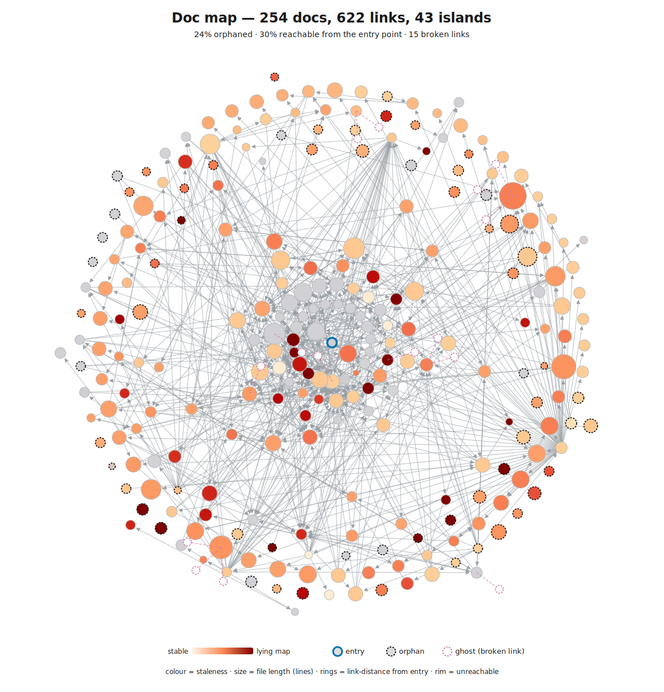
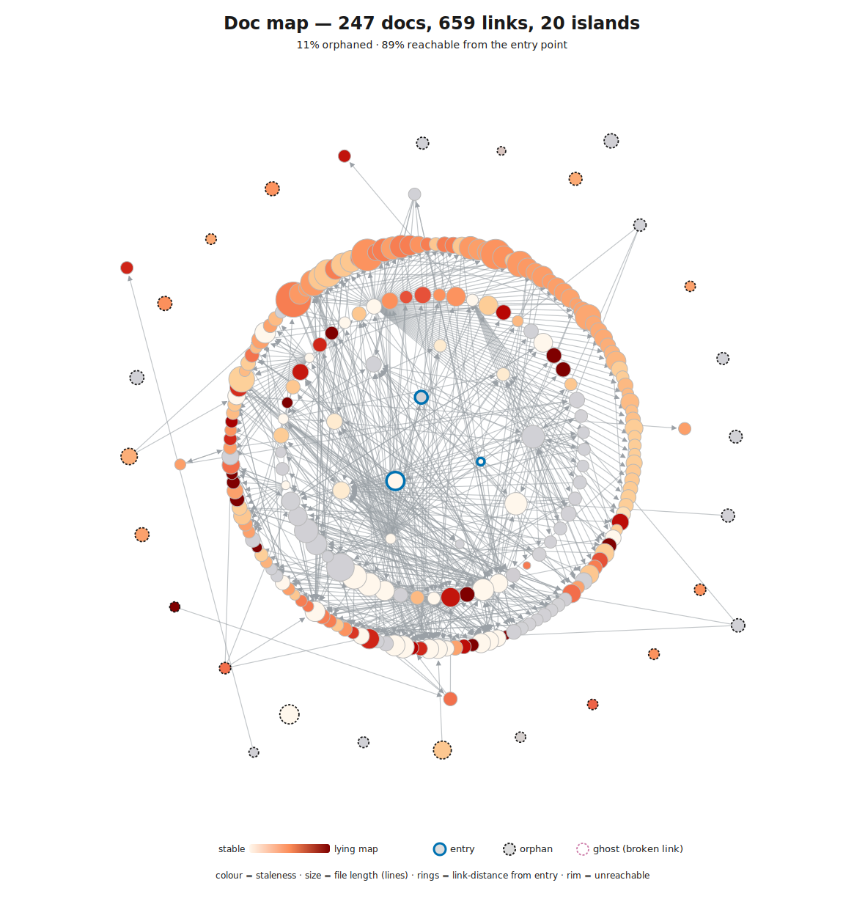

# AI Native Toolkit

A Claude Code plugin: skills, agents, and commands for AI-native development. Runs locally in your Claude Code session, against your own codebase, using whichever model you're already paying for - nothing leaves your machine beyond what Claude Code itself sends.

The headline pieces are three **skills**:

- **`/assess`** - score any codebase's readiness for AI agent contributors against an 8-layer contract model (navigability, runtime liveness, code design, linters, architecture tests, CI, coverage, review bots, AI project management), with a Codecov-style complexity hotspot SVG and a doc-navigability graph SVG (both colour-blind-safe). Generates a report + the two SVGs and opens a PR in the target repo.
- **`/huddle`** - structured multi-perspective deliberation using Six Thinking Hats with Fibonacci team sizing (solo -> debate -> huddle -> panel -> board).
- **`/deslop`** - detect and remove the telltale signs of AI writing (puffery, the rule of three, "not X but Y", filler diction, chatbot leakage, fabricated citations). Runs as a silent quality gate while writing, or as an explicit audit/edit pass. Derived from Wikipedia's "Signs of AI writing".

## What `/assess` produces

Two paired SVG views from a single run, on a real ~650k-LOC monorepo (file paths sanitized). The first asks _can an agent find its way?_ The second asks _what's risky to change?_

Here is the same repo twice: an already-good AI-native codebase **before**, then the **same repo after** its maintainers worked through the Top 3 Actions from the `/assess` report. The story is that it gets measurably cleaner. Click any image for the full interactive SVG; hover any node or block for its underlying numbers.

<table>
  <tr>
    <th width="50%">Before</th>
    <th width="50%">After applying the Top 3 Actions</th>
  </tr>
  <tr>
    <td colspan="2" align="center"><b>Doc-navigability graph</b> - can an agent traverse the docs to the right place, and is what it finds still true?</td>
  </tr>
  <tr>
    <td><a href="docs/example-doc-graph.svg"></a></td>
    <td><a href="docs/example-doc-graph-after.svg"></a></td>
  </tr>
  <tr>
    <td colspan="2" align="center"><b>Complexity hotspot heatmap</b> - which files are riskiest to change next week?</td>
  </tr>
  <tr>
    <td><a href="docs/example-heatmap.svg"></a></td>
    <td><a href="docs/example-heatmap-after.svg"></a></td>
  </tr>
</table>

> **The measurable win.** In the doc-navigability graph, reachability from the entry point climbs from **30% to 89%**, orphaned docs fall from **24% to 11%**, disconnected islands drop from **43 to 20**, and the **15 broken links are gone**. The rim of orphans thins, the islands reconnect, and the lying-map reds cool - the map an agent consults before changing anything becomes honest. The heatmap stays the same repo's complexity profile throughout: it tells you which territory is dangerous, while the graph tells you whether the map is honest.

> **How to read them.** *Doc graph* - structure encodes reachability (centre = entry, rings = link-distance from entry, rim = unreachable, dashed ring = orphan); colour encodes staleness (vivid red = a frozen doc beside churning code, a *lying map*); size encodes file length. *Heatmap* - size encodes lines of code, hue encodes cyclomatic complexity (red = high), saturation encodes recent git churn (vivid = active); the vivid-red blocks are the migration risk an agent (or human) is most likely to break next week. Both SVGs are colour-blind-safe (OrRd ramp, no red-green).

### Why this matters for an AI-driven codebase

Once a codebase outgrows any single LLM context window and AI agents become regular contributors, code quality stops being a function of *who knows what* and starts being a function of *what the system enforces*. Norms ("we prefer X") fail because new contributors - especially AI agents starting each session fresh - never read them. Contracts ("the build fails if you don't do X") work because they're enforced regardless of who's reading.

`/assess` gives you paired views to act on that. The doc-navigability graph shows whether an agent can even find its way - how much of the docs is reachable, and which are stale maps of churning code. The complexity SVG shows where the codebase is today - which files will bite next week. The accompanying `assess-report.md` shows what scaffolding is in place to stop it getting worse - a score across the layers below, each marked Present / Partial / Missing with concrete evidence:

The 9 layers (0-8) fall into three dependency-ordered bands: **read-side** (can the agent form a true picture?), **write-side** (can it be trusted to produce good output?), and **meta** (does the system keep itself honest?).

| Layer | Band | What it enforces |
|-------|------|------------------|
| 0: Agent Instructions & Navigability | read | Compact rules in `CLAUDE.md` / `AGENTS.md` / `copilot-instructions`, plus a navigable doc graph (can an agent traverse links to the right place, and is what it finds still true?) |
| 1: Runtime Legibility / Liveness | read | Is the code actually live, and can the agent find out? Intra-repo dead-code signals + observability the agent can reach (logs/metrics/traces) |
| 2: Code Design | write | Compile-time correctness via types - dimensional types, generated API clients, exhaustive enums |
| 3: Linters | write | Style + correctness with rules targeting AI failure modes (suppressions, complexity gates, leftover TODOs) |
| 4: Architecture Tests | write | Structural rules as executable tests (`depguard`, ArchUnit-style boundary checks) |
| 5: CI Pipeline | write | Every PR runs everything; failing pipeline blocks merge |
| 6: Coverage Gates | write | Test discipline as a build contract |
| 7: Review Bots | write | Design-level feedback (CodeRabbit, claude[bot]) catching what linters can't |
| 8: AI Project Management | meta | Retros, task tracking, the feedback loop that keeps the contracts above current |

The Layer 0 navigability model - treating the docs as a link graph an agent must traverse - adapts the **"Lint"** health-check from [Andrej Karpathy's LLM-wiki pattern](https://gist.github.com/karpathy/442a6bf555914893e9891c11519de94f) (hubs, orphans, connectivity, an `index.md` catalog and `log.md`), making its *structural* checks deterministic. The semantic ones it also lists - contradictions between pages, concepts lacking a page - stay out of scope (an LLM/Phase-2 job).

**Traditional tooling, applied to an AI-era question.** The assessment itself runs on conventional static analysis - `lizard`/`scc`, git history, and graph metrics over the docs and code - not the model. The LLM only writes the prose around the numbers. So a full run is fast and spends almost no model tokens, and the structural findings are reproducible run-to-run.

A codebase can be 8/8 and still on fire (great scaffolding, legacy debt) or 2/8 with a calm treemap (small codebase, no enforcement needed yet). The score tells you whether the system will catch the next class of pain before it lands; the SVG tells you where today's pain already is. The report's **Top 3 Actions** table names specific files, always - "improve code quality" is the failure mode `/assess` exists to prevent; "Add `cyclop` rule (threshold 15) to `.golangci.yml`. Current p95 ccn is 23; immediate offenders: `internal/import/parser.go` (ccn 67)" is what makes the report actionable.

**The compounding payoff.** Contracts are front-loaded - types, lint rules, architecture tests, agent instructions all take time to write. The payoff compounds: every new service, feature, and contributor inherits the contracts that already exist. Skip them and you lose 15-45 minutes per AI session to convention drift, rework, and false signals - forever. Run `/assess` periodically to ratchet the score upward; each layer you add closes a recurring cost.

A stats sidecar (`complexity-stats.json`) accompanies the report with percentiles and ranked file lists that feed the treemap and the report's hotspot callouts.

### Build artifacts and generated code are filtered by default

A single `main.dart.js` or thousands of lines of `.pb.go` shouldn't dominate the treemap. The filter catches minified bundles (`*.min.js`, `*.bundle.js`, `main.dart.js`), sourcemaps, protobuf bindings (`*.pb.go`, `*.connect.go`, `*_pb.ts`), Go generators (`wire_gen.go`, `zz_generated_*.go`), .NET source generators (`*.designer.cs`, `*.g.cs`), Dart codegen (`*.freezed.dart`, `*.g.dart`), and files under build dirs (`dist/`, `build/`, `.next/`, `.nuxt/`, `node_modules/`, etc.). Pass `--include-artifacts` to disable. If a single file still holds >30% of total LOC after filtering, the script warns - usually that's a build artifact that needs `.gitignore`.

The skill runs locally - lizard, optional scc, and git log do the analysis in your Claude Code session. No data leaves the machine.

> **Portability split.** The framework pieces (`/assess`, `/huddle`, `/deslop`, `/6hats`, `/understand` and their agents) are portable and work in any Claude Code session. The workflow commands (`/tm`, `/fix-pr`, `/fix-develop`) bake in one author's daily setup: a `<repo>-main/` + `worktree/` layout, GitHub + `gh` CLI, Task Master, CodeRabbit/claude[bot] review threads, and the Agent Teams capability flag. See [Adapting](#adapting-for-your-workflow) before relying on them in a different setup.

## Install

From inside a Claude Code session (not a shell - `/plugin` is a Claude Code command):

```text
/plugin marketplace add https://github.com/bjcoombs/ai-native-toolkit
/plugin install ai-native-toolkit@ai-native-toolkit
```

Skills appear namespaced: `/ai-native-toolkit:assess`, `/ai-native-toolkit:huddle`, `/ai-native-toolkit:deslop`. Update with `/plugin update ai-native-toolkit`. Remove with `/plugin remove ai-native-toolkit`. The plugin doesn't touch your existing `~/.claude/` files.

## Also available in Claude Desktop and claude.ai web

`/assess`, `/huddle`, and `/deslop` are installable as standalone skill ZIPs - no Claude Code required. Verified working in claude.ai web and Claude Desktop.

### Two install paths - pick by where you use Claude

| You use... | Install via | Updates |
|---|---|---|
| Claude Code | `/plugin install` (see [Install](#install) above) | Automatic on `/plugin update`. Use this when available - it's the maintained path. |
| claude.ai web or Claude Desktop only | Manual ZIP upload (below) | Manual: re-download from the rolling release and use the Skills UI's **Replace** option. See [Upgrading the standalone install](#upgrading-the-standalone-install) and [Staying notified of new versions](#staying-notified-of-new-versions) below. |

The ZIPs are rebuilt automatically from the same source on every plugin version bump, so feature parity is maintained - only the update mechanism differs.

### Prerequisites for the ZIP path

- A paid plan (Pro, Max, Team, or Enterprise) - Skills upload is not on the Free tier.
- For `/assess`: **Settings → Capabilities → Code execution and file creation** must be on (required for the Python scripts). Enable **Allow network egress** too if your repo's `pyproject.toml` pulls dependencies.
- `/huddle` and `/deslop` need neither - they're pure reasoning.

### Install (claude.ai web - verified path)

1. Download `assess.zip`, `huddle.zip`, and `deslop.zip` from the [standalone-skills-latest release](https://github.com/bjcoombs/ai-native-toolkit/releases/tag/standalone-skills-latest).
2. Open https://claude.ai/customize/skills (or sidebar → Customize → Skills).
3. Click the **+** at the top right of the Skills column.
4. Hover **Create skill →** then click **Upload a skill**.
5. Select the `.zip` (don't unzip).
6. Confirm the skill appears under **Personal skills** with toggle on and **Trigger: Slash command + auto**.

Claude Desktop has the same Skills uploader under Settings; the flow is analogous.

### Upgrading the standalone install

The Skills UI has a built-in **Replace** option - use it instead of uninstalling and re-uploading (Replace preserves any in-progress chats that reference the skill).

1. Download the new `assess.zip` / `huddle.zip` / `deslop.zip` from [standalone-skills-latest](https://github.com/bjcoombs/ai-native-toolkit/releases/tag/standalone-skills-latest).
2. In Customize → Skills, click the skill you want to upgrade.
3. Open the three-dot menu (⋮) in the top right of the detail pane.
4. Click **Replace** and select the new `.zip`.
5. The toggle and trigger settings persist; only the skill contents change.

**Checking which version you have installed.** The skill's Description field in the Skills UI ends with `Standalone build vX.Y.Z` - that's the version that shipped in the ZIP you uploaded. Compare against the [latest release](https://github.com/bjcoombs/ai-native-toolkit/releases/latest) to know if there's a newer one.

### Staying notified of new versions

Neither Claude Desktop nor claude.ai polls for skill updates - the platform has no notification mechanism for uploaded skills. Two opt-in ways to hear about new releases:

- **GitHub Watch.** On the [repo page](https://github.com/bjcoombs/ai-native-toolkit), click **Watch → Custom → Releases**. You'll get an email (and a GitHub notification) whenever a new tag ships.
- **Atom/RSS feed.** Subscribe to https://github.com/bjcoombs/ai-native-toolkit/releases.atom in any RSS reader (Reeder, Feedly, NetNewsWire, etc.).

Plugin-install users get this for free via `/plugin update ai-native-toolkit` - no subscription needed.

### Verify the auto-trigger works

In a fresh chat, try:

- **assess**: "How AI-ready is this codebase?" / "Give me a complexity heatmap"
- **huddle**: "Run a huddle on [decision]" / "Give me red-team/blue-team analysis of [question]"
- **deslop**: "Make this sound less like AI" / "De-slop this draft" / "Does this read as AI-written?"

If a skill only fires on `/skill-name` and not on natural language, the frontmatter description is missing trigger phrasing - edit `standalone_description` in `scripts/standalone_skill_config.py` and rebuild.

### Capability differences vs Claude Code

- `/huddle` runs in solo or phased sub-agent mode here - Claude reasons through each hat phase directly. Team mode (persistent agents with cross-talk) requires Claude Code.
- `/assess` runs the full layered assessment. The SVG treemap and deterministic wiki need terminal access to the bundled scripts.

## Try it

### Assess a codebase

```text
/ai-native-toolkit:assess
```

Runs against the current directory (or pass a path). Produces:

- `.assess/assess-report.md` - layered score, top 3 leverage actions, hotspot callouts
- `.assess/doc-graph.svg` - the doc-navigability graph shown above
- `.assess/complexity-heatmap.svg` - the complexity treemap shown above
- `.assess/complexity-stats.json` - percentiles and ranked file lists that feed the report

After writing, the skill asks whether to open a PR in the target repo with the report and both SVGs.

### Run a huddle on a hard decision

```text
/ai-native-toolkit:huddle Should we migrate the monolith to microservices?
```

Spawns a Fibonacci-sized team (default 3) that cycles through De Bono's six hats - facts, feelings, risks, benefits, alternatives, synthesis - and returns a structured recommendation. Use `/6hats <q>` for a faster solo variant.

## What's in the box

### Skills (auto-discovered by Claude Code)

| Skill | Description |
|-------|-------------|
| `/assess` | Layered AI-readiness assessment (0-8 contract model) plus a Codecov-style complexity hotspot SVG and a doc-navigability graph SVG (both colour-blind-safe). Ships [`complexity-treemap.py`](skills/assess/scripts/complexity-treemap.py) and [`doc-graph-svg.py`](skills/assess/scripts/doc-graph-svg.py) so the agent runs them with no external setup. Filters build artifacts and generated code by default (opt-out with `--include-artifacts`); warns when one file dominates LOC. Offers to install optional `scc` for repos heavy in markdown/JSON/YAML. Generated PRs include a self-install footer so reviewers can adopt the plugin. |
| `/huddle` | Multi-perspective deliberation using Six Thinking Hats with Fibonacci team sizing (solo -> debate -> huddle -> panel -> board). Three execution modes: solo flat-parallel, phased sub-agent (default fallback), and team mode (needs Agent Teams capability flag). |
| `/deslop` | Detect and remove the telltale signs of AI writing - puffery, the rule of three, "not X but Y", filler diction, chatbot leakage, fabricated citations. Two modes: a silent quality gate while writing prose, or an explicit de-slop/audit pass. Ships a [`references/full-checklist.md`](skills/deslop/references/full-checklist.md) A-F catalog derived from Wikipedia's "Signs of AI writing" (29 May 2026) - the skill flags itself for re-derivation if it goes stale, since the tells drift with model generations. |

### Commands (slash-only, no bundled assets)

Portable:

| Command | Description |
|---------|-------------|
| `/6hats <question>` | Solo Six Hats analysis - alias for `/huddle` at team size 1 |
| `/understand <thing>` | Deep understanding mode (nemawashi) - exhaustive context-gathering before action |

Workflow (personal setup, opt-in - see [Adapting](#adapting-for-your-workflow)):

| Command | Description |
|---------|-------------|
| `/tm` | Task Master orchestration - context-aware: starts, reviews, or cleans up tasks based on current state |
| `/issues` | GitHub-issue marathon - triage open issues (tag `agent-ready` or post clarifying questions), then run agent-ready ones to merge with Agent Teams; mirrors `/tm`'s plan-then-marathon flow |
| `/tm-marathon-config-example` | Reference configuration block to drop into a project's `CLAUDE.md` for marathon-mode `/tm` and `/issues` |
| `/fix-pr` | Autonomous PR fixing loop - iterates on CI failures and review comments until green |
| `/fix-develop` | Autonomous fix loop for failing CI on the repo's default branch |

`/tm`, `/issues`, `/fix-pr`, and `/fix-develop` share the `marathon` skill (team orchestration engine: DAG analysis, waves, crash recovery, retrospective) and the `pr-review-merge` skill (review-to-green loop + smart merge) as a single source of truth. Each command supplies a thin work-source adapter; the skills own the execution.

### Agents (invoked by skills, or directly via `Task(subagent_type=...)`)

The Six Hats team that `/huddle` and `/6hats` orchestrate:

| Agent | Role |
|-------|------|
| `white-hat` | Facts and evidence |
| `red-hat` | Gut feelings and emotional drivers |
| `black-hat` | Risks and critical analysis |
| `yellow-hat` | Benefits and opportunities |
| `green-hat` | Creative alternatives |
| `blue-hat` | Synthesis and recommendation |
| `scribe` | Structures hat output into actionable documentation |

## Why Six Hats?

A blind spot detector for high-stakes decisions, based on Edward de Bono's method.

**Cost:** 5-10x the tokens of a single prompt. Six parallel agents plus synthesis adds up.

**Benefit:** Catches the question you didn't know to ask. Black Hat might reveal your "performance optimization" is really about deployment fear. Green Hat might find the lazy solution that actually works.

**Real example:** an earlier draft of this README was reviewed via `/6hats review please`. Black Hat called it "a 13-point solution to a 2-point problem" with "rigged comparisons" and "zero evidence." That critique led to a rewrite. A single prompt wouldn't have been that harsh.

**Use it for:** architecture decisions you can't easily reverse, "should we..." questions where you suspect you're asking the wrong question, decisions where being wrong costs 100x more than the analysis, when you want pushback rather than validation.

**Skip it for:** routine decisions, debugging, implementation details, anything you can reverse. For those, a single well-crafted prompt is enough:

```text
Help me decide [X]. Be opinionated. If this is a bad idea, say so directly.
What am I not considering? What's the lazy solution that might work?
```

## Adapting for your workflow

The framework pieces (`/assess`, `/huddle`, `/6hats`, `/understand` and their agents) are reusable as-is. The workflow commands embed assumptions you will likely need to override:

- **Directory layout** - `commands/tm.md`, `commands/fix-pr.md`, `commands/fix-develop.md` all assume `~/dev/github.com/<org>/<repo>/<repo>-main/` + sibling `worktree/`. Edit the path patterns to match your structure.
- **Default branch** - `/fix-develop` derives the branch via `gh repo view --json defaultBranchRef`. `/tm` uses a `$BASE_BRANCH` variable. Other commands may still reference `develop` in prose; check before relying on them on a `main`-default repo.
- **Required external tools** - `gh` CLI for GitHub, [Task Master](https://github.com/eyaltoledano/claude-task-master) for `/tm`, optional Agent Teams capability flag (`$CLAUDE_CODE_EXPERIMENTAL_AGENT_TEAMS`) for `/tm` marathon mode.
- **Review-bot conventions** - PR-loop logic in `/tm`, `/fix-pr`, `/fix-develop` distinguishes CodeRabbit, claude[bot], and human threads. Adjust if your repo uses different bots.
- **CLAUDE.md** - your global / project `CLAUDE.md` references to the directory structure need to match.

### Git workflow assumed by `/tm`, `/fix-pr`, `/fix-develop`

```text
~/dev/github.com/<org>/<repo>/
├── <repo>-main/                    # SACRED - always on default branch, never modified
└── worktree/
    ├── <tag>/                      # Task Master tag folder (nested)
    │   ├── 1--create-schema/       # Task worktree
    │   └── 2--add-api/             # Another task worktree
    └── fix-login-bug/              # Non-TM worktree (flat)
```

The key principle: **never work directly on the default branch**. `<repo>-main/` stays on `develop`/`main` and clean; all work happens in worktrees. The `/tm` command handles worktree creation and cleanup automatically. To create one by hand:

```bash
cd ~/dev/github.com/<org>/<repo>/<repo>-main
git checkout develop && git pull origin develop
git branch fix-login-bug
git worktree add ../worktree/fix-login-bug fix-login-bug
cd ../worktree/fix-login-bug
# work, commit, push, create PR
```

## Repository structure

```text
ai-native-toolkit/
├── README.md
├── .claude-plugin/
│   ├── plugin.json                    # Plugin manifest (enables /plugin install)
│   └── marketplace.json               # Marketplace entry (enables /plugin marketplace add)
├── skills/
│   ├── assess/
│   │   ├── SKILL.md                   # Codebase readiness assessment + complexity hotspot
│   │   └── scripts/
│   │       └── complexity-treemap.py  # Codecov-style hotspot SVG generator
│   ├── huddle/
│   │   └── SKILL.md                   # Multi-lens Six Hats deliberation
│   ├── deslop/
│   │   ├── SKILL.md                   # Remove the signs of AI writing (12 high-frequency tells)
│   │   └── references/
│   │       └── full-checklist.md      # Exhaustive A-F catalog (Wikipedia-derived)
│   ├── marathon/
│   │   └── SKILL.md                   # Parallel agent marathon orchestration
│   └── pr-review-merge/
│       └── SKILL.md                   # PR review, iteration, and merge lifecycle
├── commands/
│   ├── tm.md
│   ├── tm-marathon-config-example.md
│   ├── 6hats.md
│   ├── understand.md
│   ├── fix-pr.md
│   ├── fix-develop.md
│   └── issues.md
├── agents/
│   ├── white-hat.md
│   ├── red-hat.md
│   ├── black-hat.md
│   ├── yellow-hat.md
│   ├── green-hat.md
│   ├── blue-hat.md
│   └── scribe.md
├── scripts/                           # Standalone skill ZIP build pipeline
│   ├── transform_skill.py             # Marker-based SKILL.md transformer
│   ├── standalone_skill_config.py     # Per-skill config (names, descriptions, replacements)
│   ├── build-standalone-skills.sh     # Build orchestrator
│   ├── pyproject.toml
│   └── tests/
│       ├── test_transform.py          # Transformer unit tests
│       └── test_integration.py        # Full-build ZIP content validation
├── dist/                              # Generated ZIPs (gitignored; published via CI)
└── docs/
    ├── example-doc-graph.svg          # Real /assess doc-navigability SVG, before the action sweep (README hero)
    ├── example-doc-graph-after.svg    # Same repo, doc-navigability after the action sweep
    ├── example-heatmap.svg            # Real /assess complexity heatmap, before the action sweep (README hero)
    └── example-heatmap-after.svg      # Same repo, complexity heatmap after the action sweep
```

## Contributors

Thanks to [@franklywatson](https://github.com/franklywatson) for the standalone skill ZIP pipeline that makes `/assess` and `/huddle` installable in Claude Desktop chat and Cowork ([#24](https://github.com/bjcoombs/ai-native-toolkit/pull/24)).

## License

Licensed under the Apache License, Version 2.0 - see [`LICENSE`](LICENSE) for the full text.

- The Six Thinking Hats method is the intellectual property of Edward de Bono. Licensing covers only this implementation, not the underlying methodology.
- The Task Master commands are designed for use with [Claude Task Master](https://github.com/eyaltoledano/claude-task-master) by Eyal Toledano.
