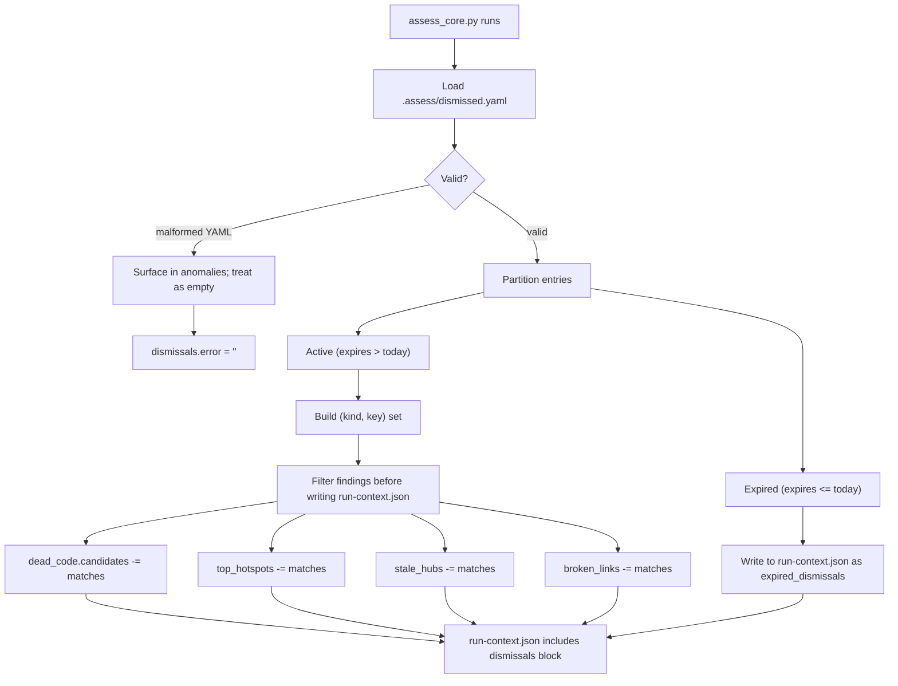

# Assess — Dismiss False Positives — PRD

> **For agentic workers:** Implement on a worktree branched from `main` (e.g. `assess-dismiss-false-positives`). Suggested home for the committed copy of this doc: `docs/superpowers/plans/2026-05-28-assess-dismiss-false-positives.md`. Steps use checkbox (`- [ ]`) syntax for tracking. This is a **MINOR** feature (new user-facing mechanism + new `run-context.json` block, backward-compatible report shape) — bump `.claude-plugin/plugin.json` `.version` minor in the same PR. `skills/assess/SKILL.md` is subject to the standalone-ZIP transform (`chat-skip` / `chat-replace` markers + `scripts/standalone_skill_config.py`); keep all standalone-divergent wording in config, not body prose, and rebuild/validate the ZIP.

**Type:** Feature / model enhancement
**Priority:** High — without this, every `/assess` re-run wastes attention re-evaluating known-OK findings and buries real new ones.
**Affected skill:** `skills/assess/` (`SKILL.md`, `scripts/assess_core.py`, `scripts/lib/`, `scripts/assess_dismiss.py`, `tests/`).

---

## Problem Statement

`/assess` is designed to be re-run on the same repo. The wiki (`.assess/index.md`, `log.md`, `hotspots/<slug>.md`) is the compounding value across runs. But every run currently re-surfaces every finding from scratch, regardless of whether the user has already reviewed it and decided it is not a real problem. The deterministic core has no concept of "this is fine."

Three concrete failure modes follow:

1. **The legitimate-by-design hotspot.** A state machine, a parser, or a generated-but-not-recognised file holds 1500 LOC with ccn 60. The user knows it is intentionally complex (per an ADR), but every `/assess` run flags it and pushes it into Top 3 Actions. After 3-4 runs the user starts ignoring the Top 3 — and then misses the real new finding the next month.
2. **The runtime-wired dead-code candidate.** Layer 1's static-reachability scan flags a Flask blueprint or a webhook handler that is *registered at runtime*. The user verifies once that it is live (via logs / telemetry, the very Layer 1 evidence the report asked for). On the next run the same candidate re-appears with the same `static reachability` caveat the user already worked through.
3. **The intentionally-stable doc.** An architecture overview is treated as the canonical static record, revised only on quarterly ADR review. `stale_hubs` flags it every run because its subject code is churning. The user cannot communicate "this is the canon, churn is expected to outpace it" without editing the doc itself.

Concrete evidence: the v1.10 self-assessment (issue #39) surfaced the same five `stale_hubs` entries that v1.9 had surfaced, and the same Top 3 hotspots. Each run, the user re-justifies each one — a soft form of decision fatigue that erodes the value of running `/assess` at all.

The underlying principle (from the v1.8 truth-pressure PRD) still holds: AI-readiness is the degree to which the codebase's self-descriptions are kept honest. A dismissal mechanism without expiry would break that — "we said it was fine 18 months ago" is the same anti-pattern `/assess` exists to surface. So this PRD makes **expiry mandatory**. The dismissal itself is under truth-pressure: it has to be re-confirmed periodically or it lapses.

## Conceptual Foundation

Three load-bearing decisions for the design below:

### 1. Dismissals are *findings under truth-pressure*, not flags

A "dismissed" entry is not a configuration toggle — it is a documented decision with an owner (`reason`), a date (`added`), and an expiry. When it expires, the finding re-appears in the report. The user re-evaluates and either re-dismisses (with a fresh expiry) or fixes. This mirrors how every other layer scores: presence is not enough; the artefact has to be *kept current*.

### 2. One central file beats inline annotations

Two patterns are common in the wider tooling ecosystem:

- **Inline source comments** (`# noqa: dead-code reason: webhook handler`, `// nolint:unused`)
- **Central manifest** (`.codeclimate.yml`, `.eslintignore`, `knip` config)

Inline scales poorly across the four finding kinds `/assess` produces — `stale_hub` and `broken_link` are about *documents*, not code symbols; `hotspot` is about a *file*, not a line. Forcing per-finding comment idioms across all 14 languages `/assess` already supports is friction without payoff. A central `.assess/dismissed.yaml` is auditable in one diff, language-agnostic, and parallels the `.no-<tool>` markers already established for install-offer skips.

### 3. The deterministic core filters; the LLM never sees dismissed findings

Dismissals apply *before* `run-context.json` is written. The LLM-authored report ground truth is the post-filter view. Two reasons:

- Otherwise every prose section would need to thread "dismissed: yes/no" awareness, and the LLM would have to remember not to surface them as findings — a per-run reliability hit the deterministic core can absorb instead.
- The diff machinery (`graduated` / `regressed` / `new` / `persistent`) already operates on `top_hotspots`. Filtering at the core means a dismissed hotspot behaves identically to one that genuinely graduated — single code path.

The `run-context.json` does grow a new top-level `dismissals` block so the LLM can mention counts in prose ("3 dismissals active, 1 expired") without having to know what was dismissed.

## Technical Context

The deterministic core has four finding categories that need dismissal support:

| Finding kind | Source field in `run-context.json` | Match key |
|---|---|---|
| `dead_code` | `dead_code.candidates[]` | `(path, symbol)` |
| `hotspot` | `stats_summary.top_hotspots[]` | `(path,)` |
| `stale_hub` | `stale_hubs[]` | `(path,)` |
| `broken_link` | `doc_graph.broken_links[]` | `(from, target)` |

Each finding kind already has a stable identity in `run-context.json` — no extra schema work is needed on the finding side.

### Schema: `.assess/dismissed.yaml`

```yaml
# Managed by `/assess`. Add entries via `assess_dismiss.py` or hand-edit.
# Expiry is mandatory - a dismissal without truth-pressure is the
# anti-pattern /assess exists to surface.
version: 1
dismissed:
  - kind: dead_code
    path: src/api/webhook_v1.py
    symbol: handle_legacy_event
    reason: >
      Registered at runtime via Flask blueprint in app.py; verified live in
      production logs (runbook: docs/runbooks/webhooks.md).
    added: 2026-05-28
    expires: 2026-11-28

  - kind: hotspot
    path: internal/state/machine.go
    reason: >
      Encodes the order-fulfilment workflow per ADR-007. Splitting would
      hide the state diagram across files; complexity is the spec.
    added: 2026-05-28
    expires: 2026-11-28

  - kind: stale_hub
    path: docs/architecture-overview.md
    reason: >
      Canonical static record; revised on the quarterly ADR review cadence,
      not per-feature.
    added: 2026-05-28
    expires: 2027-03-31  # next quarterly review

  - kind: broken_link
    from: docs/legacy/old-runbook.md
    target: docs/runbooks/observability.md
    reason: >
      Intentional - old-runbook.md is a historical record kept for SOC2
      audit trail; the link rot is the audit evidence.
    added: 2026-05-28
    expires: 2027-05-28
```

**Required fields per entry:**
- `kind` — one of `dead_code` / `hotspot` / `stale_hub` / `broken_link`
- The match-key fields for that kind (see table above)
- `reason` — free text. Empty or whitespace-only → invalid.
- `added` — ISO 8601 date the dismissal was created
- `expires` — ISO 8601 date after which the dismissal lapses

**No optional fields.** Every dismissal carries the same metadata so audit and expiry are uniform.

### Behaviour



**`run-context.json` new top-level block:**

```json
"dismissals": {
  "active_count": 3,
  "expired_count": 1,
  "by_kind": {"dead_code": 1, "hotspot": 1, "stale_hub": 1, "broken_link": 0},
  "expired_entries": [
    {"kind": "broken_link", "from": "...", "target": "...",
     "reason": "...", "added": "2025-11-28", "expires": "2026-05-28"}
  ],
  "error": null
}
```

When `error` is non-null (malformed YAML, schema violation), the file is treated as empty (no filtering) and the error string surfaces both in `run-context.json` and in the `anomalies` array. The assessment continues — broken dismissals must never block a run (same contract as the rest of Layer 0/1's read-side scans).

### Helper script: `scripts/assess_dismiss.py`

A single-purpose script that appends a dismissal to `.assess/dismissed.yaml`, with validation and dedup:

```
assess_dismiss.py <repo_root> --kind <kind> [match keys] --reason "<text>" [--expires <date>]
```

- Default `expires` is `today + 180 days` if omitted (6-month default, encouraged but not silent — print the chosen date to stderr).
- Validates the match keys against the current `run-context.json` — if no live finding matches, refuse to add (prevents accumulating dismissals for things that already graduated).
- Dedups: if an entry with the same `(kind, *match-keys)` already exists, the script updates `reason` / `added` / `expires` in place rather than creating a duplicate.
- Idempotent: re-running with the same args produces a single entry.

This script is what the SKILL.md instructs the LLM to invoke after asking the user. The LLM never edits `dismissed.yaml` directly.

### SKILL.md changes

Add a new step **6f: Offer to dismiss false positives** (after the tracker integration in Step 6, before Step 7). The step:

1. Reads `dismissals.expired_count` from `run-context.json`. If non-zero, lists each expired entry to the user and asks whether to renew, edit, or remove.
2. For each finding presented in the report (Top 3, named hotspots, named stale hubs, named dead-code candidates), asks "is any of this a false positive you want to record?" with a single batched `AskUserQuestion`.
3. For each "yes", prompts for the reason (mandatory) and optional expiry, then invokes `assess_dismiss.py`.
4. Re-runs `assess_core.py` against the now-updated dismissals file so the report and wiki reflect the post-filter view, if any dismissals were added.

Step 4 (re-run) is what makes this a clean user experience — the same run produces the corrected report; the user doesn't have to re-invoke `/assess` to see their dismissals take effect.

Layer 1 and Layer 0 prose also gets a one-line caveat: when `dismissals.active_count > 0`, mention the count and remind the reader that those findings are not gone, they are *under managed truth-pressure with a stated expiry*.

## Acceptance Criteria

- [ ] **Schema:** `lib/dismissals.py` defines a `Dismissal` dataclass and a YAML loader that validates all required fields. Invalid entries (missing key, empty reason, malformed date, unknown kind) cause the whole file to be rejected with a clear error string — partial loading silently drops would be worse than no dismissals at all.
- [ ] **Loader degradation:** A missing `.assess/dismissed.yaml` loads as an empty list, no error. A malformed file loads as empty + `error` populated + `anomalies` entry. Assessment never blocks.
- [ ] **Filtering integrated:** `assess_core.py` calls the loader once, partitions into active/expired, builds match-key sets per kind, and filters all four finding sources before writing `run-context.json`. Active dismissed findings do not appear in `dead_code.candidates`, `top_hotspots`, `stale_hubs`, or `doc_graph.broken_links`.
- [ ] **Dismissed candidate count is honest:** `dead_code.candidate_count` reflects the post-filter count; the original total (pre-filter) is reported as `candidate_count_pre_dismissal` for transparency. Same pattern for any other count fields the existing readers rely on.
- [ ] **Expiry surfaces:** Expired dismissals re-appear in their original finding list AND are listed in `dismissals.expired_entries`. The LLM has both pieces of evidence to call them out in the report.
- [ ] **`run-context.json` `dismissals` block:** Present on every run (empty when no dismissals exist). Existing readers ignore unknown top-level keys; this is additive.
- [ ] **Helper script `scripts/assess_dismiss.py`:** Implements the CLI shape above. Validates the match key against `run-context.json` (refuses to add dismissals for non-existent findings). Dedups by `(kind, *match-keys)`. Default expiry = today + 180 days, with the chosen date printed to stderr.
- [ ] **SKILL.md Step 6f:** Documents the dismissal flow. Standalone-ZIP transform validated (`chat-skip` / `chat-replace` markers correct, build is clean).
- [ ] **SKILL.md Layer 0 / Layer 1 prose update:** Mentions `dismissals.active_count` when non-zero and frames dismissals as "under managed truth-pressure with expiry", not as silent suppression.
- [ ] **Tests:**
  - All four finding kinds dismissed end-to-end (added entry → finding filtered).
  - Match-key precision (a dismissal on `src/a.go:foo` does not silence `src/a.go:bar`).
  - Expiry edge cases (expires today → still expired; expires tomorrow → still active; UTC vs local-time ambiguity resolved one way and documented).
  - Malformed YAML → empty load + anomaly + error string.
  - Missing file → empty load + no error.
  - Helper script: dedup behaviour, validation against `run-context.json`, default-expiry calculation.
- [ ] **Plugin version:** bumped MINOR (1.11.0 → 1.12.0) in the same PR.
- [ ] **Standalone build passes:** `bash scripts/build-standalone-skills.sh assess` produces a clean ZIP; `cd scripts && uv run --with pytest pytest` and `cd skills/assess && uv run --with pytest pytest` both green.

## Out of Scope

These are deliberately *not* in scope and will not be tracked separately — if they matter later, a new PRD will pick them up:

- **Inline source-level dismissals** (e.g. `# /assess:dismiss-dead-code`). The central-file approach is the design; adding a second mechanism would fragment the audit trail.
- **Severity downgrade as an alternative to dismissal** (e.g. "this is real but low priority"). The existing `dismissed.yaml` does not need a severity field; the existing report structure (Top 3 + Additional Opportunities) already handles severity by position. A finding worth mentioning but not acting on stays in Additional Opportunities, undismissed.
- **Cross-repo dismissal sharing** (e.g. a centrally-managed list across an org's repos). `/assess` is per-repo by design.
- **Auto-dismissal heuristics** (e.g. "after 3 runs of `persistent`, auto-suggest dismissal"). The dismissal decision belongs to the user; suggesting it would inject a soft form of the decision fatigue this PRD exists to address.

## Risk Assessment

- **Risk:** users dismiss too aggressively and the report becomes vacuous.
  **Mitigation:** mandatory expiry is the structural answer. Reports also surface `active_count` so vacuum is visible. The Layer 0/1 prose update explicitly frames dismissals as truth-pressured, not silent.
- **Risk:** the helper script's "validate against `run-context.json`" check fails when `run-context.json` is stale or missing (first run).
  **Mitigation:** the script reads from `.assess/run-context.json` directly; if absent, it instructs the user to run `/assess` first. No silent failure.
- **Risk:** schema drift between `dismissed.yaml` and what the loader expects.
  **Mitigation:** the schema carries a `version: 1` field. v2 would be a separate PRD; the loader rejects unknown versions with a clear error.
