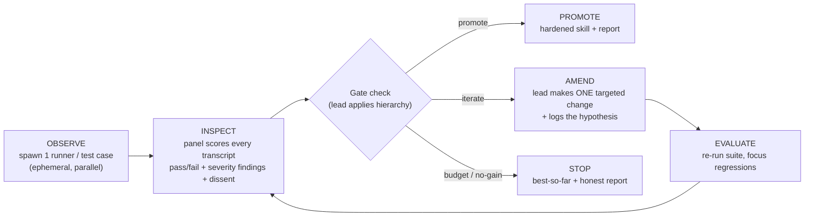

# Design: `skill-forge` - judge-panel skill-hardening harness

Date: 2026-06-02
Status: Approved for implementation planning

## Problem

The toolkit has no quality gate for skills themselves. A `SKILL.md` is written, eyeballed,
and shipped. "Works on paper" is the bar, and paper lies: a skill can read well and still
fail in execution - a `TRIGGER` clause that never fires, a body an agent rationalizes its
way out of following, denormalized training knowledge bloating the context window, an edge
case nobody exercised. Nothing proves a skill *behaves* before it lands in the library.

The toolkit also already owns the two machines needed to fix this. `marathon` is a
source-agnostic team-execution engine (ephemeral one-job teammates, waves, crash recovery,
retrospective). `huddle` is a multi-perspective deliberation chair (a lead chairing
professional lenses that cross-talk and deliver a verdict with preserved dissent). Neither
is pointed at skill quality.

## Goal

Add `skill-forge`: a shippable skill that takes a skill (draft or existing) plus its intent
and drives it through adversarial execution rounds judged by a panel, amending one thing per
round, until it clears a strict 3-tier promotion gate or hits a budget ceiling. The output is
a hardened `SKILL.md` plus an honest forge report.

The acceptance test for `skill-forge` is **`skill-forge` run on itself**. A harness that
gates other skills has no credibility until it has survived its own gauntlet. Its promotion
gate is its own gate.

## Non-goals

- **Not an authoring tool.** `brainstorming` + superpowers `writing-skills` author skills
  from scratch. `skill-forge` is the prove-and-promote gate that runs *after*, or standalone
  against a skill that already exists. One line in the SKILL.md states this boundary.
- **No real-install execution.** Runners exercise the draft via prompt-injection, not by
  installing it as a live plugin skill. (Rejected for breaking the standalone/chat path and
  per-round cost - see Decisions.)
- **No deterministic CI snapshot of forge output.** `skill-forge` is LLM-driven and
  non-deterministic; the flawed fixture is a manual/example artifact, not a pytest assertion.
- **No new behaviour in `marathon` or `huddle`.** `skill-forge` borrows their idioms; it does
  not modify them.

## Architecture

### A new shippable skill

```
skills/skill-forge/
  SKILL.md
  references/
    judge-lenses.md            The 5 lens definitions + what each flags
    test-taxonomy.md           happy / edge / adversarial / composition design guide
    gate-hierarchy.md          The 3-tier gate + promotion decision table
    forge-report-template.md   The shipped report format
  tests/
    fixtures/
      flawed-sample-skill/     A skill with one planted defect per lens (see Phase A-)
```

Pure markdown orchestration, like `marathon` and `huddle` - no Python core. It ships as a
standalone ZIP for Claude Desktop / Cowork, so all team infrastructure is wrapped in
`chat-skip` / `chat-replace` markers exactly as `huddle` does.

### The hybrid team

`skill-forge` fuses both backbones: `marathon`'s ephemeral execution team runs the draft,
`huddle`'s persistent deliberation panel judges it, and the lead chairs the loop.

| Role | Lifecycle | Job |
|------|-----------|-----|
| **Forge Master (lead, chair)** | whole run | Designs test cases, spawns runners, chairs the panel, applies the gate hierarchy, makes the one amend per round, decides promote/stop. Delegates, never executes (marathon lead authority). |
| **Runners** | ephemeral, one per test case per round | Fresh context. Get `draft content + one test-case input`, execute via prompt-injection, return a transcript + self-report. Shut down after the round. |
| **Judge panel** | persistent across rounds | Each judge is one skill-quality lens with a persisted identity, so it can report "better/worse than last round" (feeds Gate 3) and catch regressions. Cross-talk via `SendMessage` (team mode) or a shared synopsis (phased). |

### Role boundary (recursion guard, axis 1)

**Runners apply, lenses judge, lead amends.** This separation is not stylistic - it is one of
the two ways self-application could recurse without terminating. A runner that starts judging,
a judge that starts amending, or a lead that starts executing collapses the loop. The
boundary generalizes `marathon`'s "lead delegates, never executes" to all three roles, and
every spawn prompt states the role's lane and its "not my job" boundary explicitly.

## Input contract

| Input | Required | Notes |
|-------|----------|-------|
| Target skill | yes | Path to a `SKILL.md`, or inline draft text |
| Intent / spec | yes | What it should do + who/what should trigger it. The ground truth the Fidelity lens judges against. If missing, the lead derives it from the draft and confirms with the user before round 1. |
| Known failure modes / existing tests | no | Seeds the test corpus |

## The judge panel: five lenses

Huddle's professional lenses, repointed at skill quality. Fibonacci-sized like huddle (2 for
a quick check, 3-5 default, all 5 for a deep forge). Confidence is **not** a lens - it is the
stopping decision in Gate 2, not an artifact perspective.

| Lens | Judges | Defect class it owns |
|------|--------|----------------------|
| **Fidelity** | Did the runner's behaviour match the stated intent? | The core pass/fail. Skill says X, agent did Y. |
| **Adversarial** | Can it be broken? Ambiguous input, boundaries, rationalization escapes, and **future-edit safety** (does it stay correct when someone edits it later)? | Maintainability folds in here as an attack vector. |
| **Compression** | Is it as short as it can be? | Bloat, redundancy, denormalized training knowledge ("point, don't paste"). |
| **Usability** | Could a fresh agent follow it without confusion? | Ordering, missing steps, contradictions. |
| **Trigger/routing** | Will the router fire it on the right phrases and not over-fire? | A bug class no other lens sees - the one thing prompt-injection cannot behaviourally test, so it is judged statically against the `description`/`TRIGGER` clause. |

## The loop: OBSERVE -> INSPECT -> AMEND -> EVALUATE



1. **OBSERVE** (runner team). Lead finalizes the test suite. Spawns one ephemeral runner per
   case in parallel; each runs draft-as-instructions on its input and returns a transcript.
2. **INSPECT** (judge panel). Each judge reviews every transcript through its lens, producing
   per-case pass/fail plus severity-rated findings (LOW/MED/HIGH) and dissent. Panel
   cross-talks. The lead-chair synthesizes a round verdict.
3. **Gate check** (lead applies the hierarchy below).
4. **AMEND** (lead). Synthesize the panel's findings into **one** minimal targeted change.
   Edit the draft. Log the hypothesis: "changed X because the <lens> found Y; expect Z to
   improve." One change per round isolates a single hypothesis, so every round's delta is
   causally attributable - the rigor of the A/B model preserved inside the panel model, and
   consistent with the "minimal targeted regeneration over wholesale rewrites" principle.
5. **EVALUATE** (regression). Re-run the suite, focusing previously-passing cases; persistent
   judges flag regressions. Return to INSPECT.

### One-change-per-round: default with an evidence-based escape

This is the default discipline. The Phase B self-forge run is its empirical test: if the
panel keeps surfacing genuinely independent issues and one-change-per-round drags, that shows
up firsthand and the rule can be relaxed to "one change per independent finding-cluster."
Decided by evidence from forging the forge, not asserted up front.

## Test-case taxonomy

The lead designs 3-5 cases spanning **happy path / edge case / adversarial / composition**
(the skill combined with another skill or concept). When a new failure mode surfaces
mid-run, it is added to the corpus. The corpus is **persistent across re-forge runs** - it
accumulates a skill's known failure modes, so re-forging later re-runs them (compounding,
like the `.assess/` wiki). Self-application is the deciding argument: forging the forge
benefits directly from accumulating the meta-skill's own failure modes.

## Gate hierarchy and promotion

A strict hierarchy, not a menu. Dissent is always documented, never suppressed.

| Gate | Bar | Effect |
|------|-----|--------|
| **Gate 1 - Objective** | Every test case passes the Fidelity judge | Hard. Any fail -> not promotable, must amend. Prevents standard-drift. |
| **Gate 2 - Panel confidence** | All green *and* no HIGH-severity dissent | LOW/MED dissent is documented, does not block. Only HIGH blocks. Catches "passes but weak." |
| **Gate 3 - Diminishing returns** | A round produced measurable gain | No gain -> stop coasting. |
| **Escape hatch - Budget** | Max rounds / token ceiling | Always terminates with best-so-far + an honest "not promoted, here's why." |

**Promote** if and only if Gate 1 passes **and** Gate 2 passes. Otherwise **STOP** at Gate 3
or the budget ceiling with the best-so-far artifact and a report that names which gates were
and were not met.

## Execution modes (graceful degrade)

Mirrors `huddle`, capability-detected via `$CLAUDE_CODE_EXPERIMENTAL_AGENT_TEAMS`. Required
because the skill ships as a standalone ZIP where Agent Teams do not exist.

| Mode | When | Mechanism |
|------|------|-----------|
| **Team** | flag on, panel >= 2 | Persistent judges cross-talk via `SendMessage`; ephemeral runners spawned per round |
| **Phased sub-agent** | flag off | Lead keeps a running synopsis; spawns runner + judge subagents per round, fresh contexts |
| **Solo** | chat / standalone ZIP | Lead runs runners as plain subagents and judges through each lens itself, sequentially |

## Self-application: the bootstrap

`skill-forge` cannot be forged before it runs, so it is built in ordered phases, and the
version that ships is the one its own panel signed off.

| Phase | What | Forged? |
|-------|------|---------|
| **A- - Flawed fixture** | Build the target-skill fixture *first* - it is the system's first input. One planted defect per lens (5 defects: a fidelity gap, an adversarial/rationalization hole, bloat, a usability ambiguity, a bad TRIGGER). | n/a |
| **A - Seed** | Hand-author `SKILL.md` + references well enough to execute one full loop. | No (it does not exist yet) |
| **B - Self-forge** | Run `skill-forge` on `skill-forge`, using the fixture as the target it forges. Panel critiques the seed, lead amends one thing per round, iterate until it clears its own 3-tier gate. | Yes, by itself |
| **C - Promote** | The seed that survived ships as v1. The Phase B forge report ships as the canonical example. | - |

### The fixture calibrates the panel, not just the skill

One defect per lens means a correct panel catches all five. If a lens misses its planted
defect, the **panel** is broken - independent of whether the skill under test is good. The
fixture is therefore a panel-calibration harness as much as a forge target, and it doubles as
a teaching example. It is a manual/example artifact, not a CI assertion.

### Recursion guard, axis 2: depth-1

Self-application is depth-1. When the skill under test *is* `skill-forge`, runners exercise it
against the target-skill fixture, never against `skill-forge` again. "Forge the forge" tests
its ability to forge *something else*; it does not build an infinite tower. Combined with the
role boundary (axis 1), both recursion paths are closed by construction.

## Artifacts, isolation, recovery

- **Isolation.** Never touch the user's pristine source. In a git repo, work on a
  branch/worktree; in chat, a scratch file. Each amend is a visible diff.
- **Artifacts.** The hardened `SKILL.md`; a **forge report** (intent, suite, per-round
  hypothesis->result log, gate ledger, severity-tagged dissent log, final verdict, rounds +
  estimated waste); the grown test corpus. Optional end-offer to open a PR, like `assess-pr`.
- **Crash recovery + retrospective.** Round-tracking JSON in the scratch dir survives crashes
  and reconciles on restart; an end-of-run retrospective (which lens caught the most, waste
  estimate) - both straight from `marathon`.

## Decisions

| Decision | Choice | Why |
|----------|--------|-----|
| Home | Shippable toolkit skill | Same shelf as `assess`/`huddle`; version-bumped, CI-gated, standalone-ZIP. |
| Iteration model | Judge-panel refinement | Panel critiques one draft per round; no literal A/B control/variant split. |
| Team shape | Hybrid (marathon runners + huddle panel + chair lead) | Reuses both backbones; rejected wholesale marathon adapter (its fire-and-forget-to-merge model fits iterative refinement awkwardly). |
| Execution | Hybrid prompt-injection + trigger lens | Portable (works in chat/standalone), proves execution, closes the trigger gap a lens can read but injection cannot test. |
| Gate | 3-tier hierarchy + budget escape | Gate 1 prevents standard-drift; Gate 2 catches weak-but-passing; Gate 3 prevents coasting; budget always terminates. |
| Lenses | Fidelity, Adversarial, Compression, Usability, Trigger/routing | Maintainability folds into Adversarial; confidence is the gate, not a lens. |
| Corpus | Persistent across runs | Self-application benefits from accumulated failure modes. |
| Recursion guard | Depth-1 + role boundary | Two independent recursion paths, both closed by construction. |

## Open questions for the plan

- Exact round-tracking JSON schema (adapt `marathon`'s `pr-tracking.json`).
- Whether the forge report and grown corpus persist inside the target skill's directory or a
  sidecar, and how that interacts with the standalone path.
- Concrete budget defaults (max rounds, token ceiling) - tune during the Phase B self-forge.
