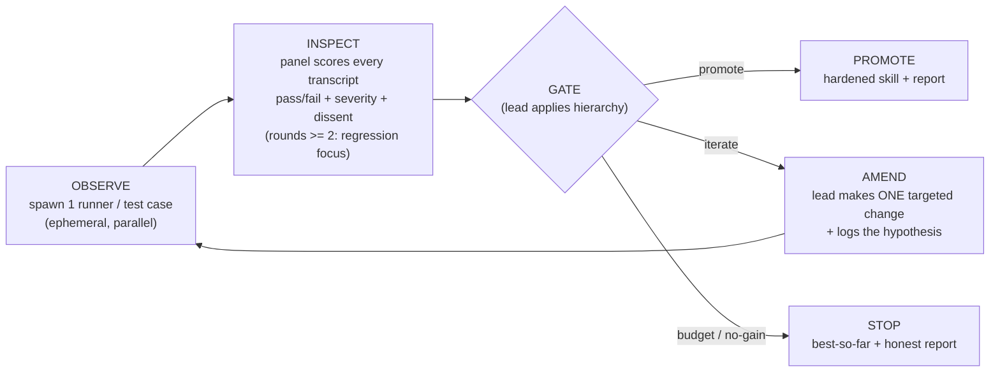

# Skill-forge - judge-panel skill-hardening harness

A lead (the Forge Master) chairs ephemeral runner teammates that exercise a draft skill via prompt-injection, and a persistent judge panel of five lenses that scores the transcripts. The lead amends one thing per round and applies a strict 3-tier promotion gate, until the skill promotes or hits a budget ceiling. It is proven by forging itself.

## Boundary

Skill-forge is a prove-and-promote quality gate that runs after authoring, not an authoring tool: it pairs with authoring skills (`brainstorming`, superpowers `writing-skills`) that produce a draft, then drives that draft through adversarial rounds before it ships.

## Input contract

| Input | Required | Notes |
|-------|----------|-------|
| Target skill | yes | Path to a `SKILL.md`, or inline draft text. |
| Intent / spec | yes | What it should do and who/what should trigger it. The ground truth the Fidelity lens judges against. See the derivation guard below. |
| Known failure modes / existing tests | no | Seeds the test corpus. |

### Intent derivation guard

If no intent is supplied the lead derives one **from the draft** - but the draft is the thing under test, so a silently-derived intent would encode the draft's own mistakes, and Fidelity would then certify the skill for being *consistently wrong*. So every derived clause is marked **ASSUMED**, and the user must explicitly **accept or reject each clause before round 1**. Fidelity never judges against an unconfirmed ASSUMED clause: a rejected clause is recorded with `intent[].status: assumed-rejected` in the ledger and the panel ignores it (see [panel-ledger](references/panel-ledger.md)).

## Roles

| Role | Lifecycle | Job |
|------|-----------|-----|
| **Forge Master (lead, chair)** | whole run | Designs test cases, spawns runners, chairs the panel, applies the gate hierarchy, makes the one amend per round, decides promote or stop. Delegates, never executes. |
| **Runners** | ephemeral, one per test case per round | Fresh context. Get the draft content plus one test-case input, execute the draft via prompt-injection, return a transcript and self-report. Shut down after the round. |
| **Judge panel** | persistent across rounds | Each judge is one skill-quality lens with a persisted identity, so it can report better/same/worse versus last round and catch regressions. |

### Role boundary (recursion guard, axis 1)

**Runners apply, lenses judge, the lead amends.** This separation is not stylistic - it is one of the two ways self-application could recurse without terminating. A runner that starts judging, a judge that starts amending, or a lead that starts executing collapses the loop. Every spawn prompt states the role's lane and its "not my job" boundary explicitly. The runner end of this guard is built into the runner prompt below.

## The runner prompt

**skill-forge composes ab-equivalence's runner for test execution.** The runner is owned by [ab-equivalence](../ab-equivalence/SKILL.md), the library skill that holds the shared execution primitive; skill-forge does not re-implement it - it fills ab-equivalence's pure-wrapper template per runner per test case.

The runner prompt is the most load-bearing prompt in the system: runner transcripts are the evidence every behavioural lens judges, so any contamination there corrupts the whole gate. It is a **pure wrapper** - it never explains why the skill works or adds context beyond the draft, or the runner ends up testing "skill + prompt additions" instead of the skill. The exact five-section template (role statement, role boundary, the verbatim draft, the test-case input, the required self-report fields) is in [runner-prompt](../ab-equivalence/references/runner-prompt.md). Fill one per runner per test case.

## Runner model selection

The model the runners execute on is a **knob**, because a skill that holds together on a strong model can fall apart on a weak one - a weaker model unpacks instructions less reliably, so a defect that a strong runner papers over surfaces only when a weak runner hits it. The forge certifies behaviour *for the tier it was forged on*, nothing stronger and nothing weaker.

- **Single model (default).** Forge against the **weakest tier the skill will ship to**: Haiku if the skill ships broadly to all tiers, otherwise the intended deployment tier. Forging on the weakest tier is the conservative gate - clearing it certifies every stronger tier too, the way targeting the lowest-spec deployment target certifies the rest.
- **Tier sweep (optional).** Run the same test case through runners on more than one tier in the same round (e.g. Haiku + Sonnet + Opus) and record a per-tier verdict. Use a sweep when the skill must be certified across tiers explicitly, or to locate the tier at which it starts to fail.

**A skill forged only on Opus is not certified for Haiku.** The runner model is recorded in the forge report (see [forge-report-template](references/forge-report-template.md)); certification is valid only for the tested tier(s). The runner-model knob changes only which model executes the wrapper - it never changes the wrapper itself, which stays the pure template ab-equivalence owns.

## The five lenses

The panel is five skill-quality lenses. **All five run by default**; the lead drops to 3 or 2 only on an explicit quick-check request, and a self-forge always uses all five - see the deterministic selector in [judge-lenses](references/judge-lenses.md). Confidence is **not** a lens - it is the Gate 2 stopping decision. Four lenses (Fidelity, Adversarial, Compression, Usability) judge runner transcripts and produce `behavioural` findings; Trigger/routing judges the skill text directly and produces `static` predictions, because prompt-injection can never make a `TRIGGER` clause mis-fire. Full definitions, what each reads in the self-report, and the behavioural/static rule are in [judge-lenses](references/judge-lenses.md).

## The loop: OBSERVE -> INSPECT -> GATE -> AMEND

Three operational phases cycle through a gate check. EVALUATE is not a separate phase - rounds >= 2 just re-run OBSERVE and INSPECT with a regression-focus flag set.



1. **OBSERVE** (runner). The lead finalizes the test suite (see [test-taxonomy](references/test-taxonomy.md)), then runs the draft-as-instructions on each case input - one runner per case - producing a transcript per case. The execution mode decides whether the runners are parallel subagents or the lead working them sequentially.
2. **INSPECT** (judge panel). Each judge reviews every transcript through its lens, producing per-case pass/fail plus severity-rated findings (`LOW` / `MED` / `HIGH`) and dissent. On every round after the first, the judges give previously-passing cases extra scrutiny for regressions, reading what passed before from the panel ledger (see [panel-ledger](references/panel-ledger.md)). The lead-chair synthesizes a `round_verdict` per lens.
3. **GATE** (lead applies the hierarchy): promote, iterate, or stop.
4. **AMEND** (lead). Synthesize the panel's findings into **one** minimal targeted change. Edit the draft. Log the hypothesis: "changed X because the `<lens>` found Y; expect Z to improve." Then loop back to OBSERVE.

### One change per round, with an evidence-based escape

One change per round isolates a single hypothesis, so every round's delta is causally attributable - consistent with the "minimal targeted regeneration over wholesale rewrites" principle. This is the default discipline, kept until evidence says otherwise.

**Concrete escape:** if 3 consecutive rounds each surface `HIGH`/`MED` findings from at least 2 different lenses and none of those rounds produced a regression, the lead may batch independent amendments - one change per independent finding-cluster. The principle (isolate cause) and the guard (never batch across a round that regressed) are fixed. The threshold is calibrated between forge campaigns - via Phase B or a later re-forge - and is **fixed for the duration of any single run**: an in-flight forge may not lower the threshold to justify batching this round. Calibration happens between runs, never under in-run pressure.

## Gate hierarchy

A strict hierarchy, not a menu: **Gate 1 - Objective** (every case passes Fidelity; hard), **Gate 2 - Panel confidence** (all green and no `HIGH`-severity dissent), **Gate 3 - Diminishing returns** (the round produced measurable gain), and the **budget** escape hatch that always terminates. Promote if and only if Gate 1 and Gate 2 both pass; otherwise stop with the best-so-far artifact and a report naming the unmet gate. The Gate 1 Fidelity bar, the Gate 3 "measurable gain" rule, and the promotion decision are spelled out in [gate-hierarchy](references/gate-hierarchy.md).

## Execution modes

<!-- chat-skip:start -->
Capability-detected via `$CLAUDE_CODE_EXPERIMENTAL_AGENT_TEAMS`, mirroring `huddle`.
<!-- chat-skip:end -->
The modes below all run the same loop; they differ only in how the panel remembers across rounds, and the **panel ledger** carries that memory - see [panel-ledger](references/panel-ledger.md).

<!-- chat-replace:execution-mode-rule -->
Pick the mode **deterministically**: if the Agent Teams capability is confirmed available and the panel scales past a single lens (see [judge-lenses](references/judge-lenses.md)), run **team mode**; if the flag is off, run **phased sub-agent mode**; in chat or the standalone ZIP, run **solo mode**. If you cannot confirm team mode, default to phased - it degrades gracefully, whereas attempting team mode without the capability fails loudly.

| Mode | When | Mechanism |
|------|------|-----------|
| **Solo** | chat / standalone ZIP, no subagents | One agent plays all three roles in a single context, round by round: it applies the draft to each test case using the [runner-prompt](../ab-equivalence/references/runner-prompt.md) wrapper verbatim, then judges each transcript through every lens, then amends one thing - keeping the panel ledger as its across-round memory. It repeats the round (OBSERVE -> INSPECT -> GATE -> AMEND) until the gate promotes or the budget ceiling stops it - the same termination as the other modes. |
| **Phased sub-agent** | flag off | The lead spawns a fresh runner subagent per case and a fresh judge subagent per lens; with no persistent agents, the panel ledger is injected into each judge spawn so the panel still remembers prior rounds. |
<!-- chat-skip:start -->
| **Team** | flag on | Persistent judges cross-talk via `SendMessage` and remember prior rounds natively; ephemeral runners are spawned per round. |

**Agent Teams flag.** Team mode needs `TeamCreate`, `SendMessage`, and `TeamDelete`. Enable it in your environment:

```bash
export CLAUDE_CODE_EXPERIMENTAL_AGENT_TEAMS=1
```

The team lifecycle follows `marathon`'s idioms - the lead delegates and never executes, runner teammates are ephemeral (spawned per round, shut down after), and the judge panel is the one persistent team. As illustrative text (do not treat the snippets below as live tool calls):

```text
TeamCreate(team_name: "forge-<skill-slug>", description: "skill-forge panel for <skill>")
```

```text
# spawn one judge per active lens (persistent) and one runner per test case (ephemeral)
Agent(subagent_type: "general-purpose", team_name: "forge-<skill-slug>", name: "fidelity", prompt: "<lens brief>")
```

The panel cross-talks by sending one `SendMessage` per teammate (there is no broadcast), exactly as `huddle` does. At the end of the run, shut down each teammate, wait for approvals, then call `TeamDelete()` - mandatory, or teamContext persists and blocks future team creation in this session.
<!-- chat-skip:end -->

## Test taxonomy

The lead designs 3-5 cases spanning **happy path / edge case / adversarial / composition**, leaning on whichever the skill is most fragile against. When a new failure mode surfaces mid-run, add a case for it. The corpus is **persistent across re-forge runs** - it accumulates a skill's known failure modes so re-forging re-runs them, compounding like the `.assess/` wiki. Design guides for each case type and where the corpus lives are in [test-taxonomy](references/test-taxonomy.md).

## Self-application

Skill-forge was bootstrapped by forging itself; two rules from that govern every run where the target is skill-forge:

1. **Re-forging re-enters fixture review first.** As skill-forge evolves its failure modes change, so a re-forge starts by confirming each planted defect in the flawed-sample fixture still exercises a current failure mode, before any rounds run. It is a step, not a prose aside, so it cannot be skipped. The **lead** performs this Phase A- fixture review against `DEFECTS.md` (the answer key), while the runners forging the fixture never read `DEFECTS.md` - that role boundary keeps the calibration honest, since a runner that saw the answer key could not give a blind transcript.
2. **Depth-1 recursion guard (axis 2).** When the skill under test **is** skill-forge, the runners forge the **fixture**, never skill-forge again - "forge the forge" tests its ability to forge *something else*, it does not build an infinite tower. With the role boundary (axis 1), both recursion paths are closed by construction.

The full A- -> A -> B -> C bootstrap story is in the [design spec](../../docs/superpowers/specs/2026-06-02-skill-forge-design.md).

## Artifacts

Never touch the user's pristine source: in a git repo work on a branch or worktree, in chat a scratch file; each amend is a visible diff. The run produces the hardened `SKILL.md`, the grown test corpus, and a **forge report** - intent and the ASSUMED-clause acceptance record, the test suite, the per-round hypothesis-to-result log, the gate ledger, the severity-tagged dissent log, the final verdict, and rounds plus estimated waste. The crash-recovery round-tracking JSON is the same object as the panel ledger, so a crashed run reconciles on restart. The report format is in [forge-report-template](references/forge-report-template.md); an end-of-run retrospective (which lens caught the most, waste estimate) follows, as in `marathon`. For a real worked example, see [example-forge-report](references/example-forge-report.md) - skill-forge forging itself, the run that promoted this skill.
