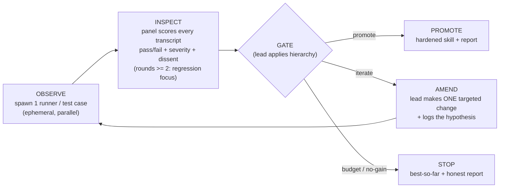

# Skill-forge - judge-panel skill-hardening harness

A lead (the Forge Master) chairs ephemeral runner teammates that exercise a draft document via prompt-injection, and a persistent judge panel that scores the transcripts. The lead amends one thing per round and applies a strict 3-tier promotion gate, until the document promotes or hits a budget ceiling. It is proven by forging itself.

The target is a `SKILL.md` by default, but the same loop hardens **any agent instruction file** - `CLAUDE.md`, `AGENTS.md`, `GEMINI.md`, `.cursor/rules/*`, `.github/copilot-instructions.md` - because those files have the same failure surface as a skill: they steer an agent and can mislead it. The artifact type is detected deterministically and drives three adaptations (the lens set, the runner variant, and the canonical intent); see [Artifact type and the lens-selector](#artifact-type-and-the-lens-selector) below.

## Boundary

Skill-forge is a prove-and-promote quality gate that runs after authoring, not an authoring tool: it pairs with authoring skills (`brainstorming`, superpowers `writing-skills`) that produce a draft, then drives that draft through adversarial rounds before it ships. For an instruction file the same boundary holds - it gates a `CLAUDE.md`/`AGENTS.md` that already exists or has just been drafted; it does not write one from scratch.

## Input contract

| Input | Required | Notes |
|-------|----------|-------|
| Target | yes | Path to a `SKILL.md` (default), or to any agent instruction file (`CLAUDE.md`, `AGENTS.md`, `GEMINI.md`, `.cursor/rules/*`, `.github/copilot-instructions.md`), or inline draft text. The artifact type is detected from the path/filename - see [Artifact type and the lens-selector](#artifact-type-and-the-lens-selector). |
| Intent / spec | yes | What it should do and who/what should trigger it. The ground truth the Fidelity lens judges against. For an instruction file the canonical intent is derivable - see the derivation guard below. |
| Known failure modes / existing tests | no | Seeds the test corpus. |

### Intent derivation guard

If no intent is supplied the lead derives one **from the draft** - but the draft is the thing under test, so a silently-derived intent would encode the draft's own mistakes, and Fidelity would then certify the document for being *consistently wrong*. So every derived clause is marked **ASSUMED**, and the user must explicitly **accept or reject each clause before round 1**. Fidelity never judges against an unconfirmed ASSUMED clause: a rejected clause is recorded with `intent[].status: assumed-rejected` in the ledger and the panel ignores it (see [panel-ledger](references/panel-ledger.md)).

**Canonical intent for an instruction file.** An always-loaded instruction file has one job that does not vary by repo: **make a cold-start agent productive in this repo without breaking it.** That canonical intent is derived from the repo (its build, test, lint, and CI gates name what "without breaking it" means), so the lead seeds it automatically and decomposes it into clauses - e.g. "the commands and paths the file states exist and match what the repo's tooling enforces", "a fresh agent can complete a routine task from this file alone", "the file does not steer the agent into a build-breaking shortcut". These are still **ASSUMED** clauses: derived from the repo, not handed down, so they pass the same accept/reject confirmation before round 1. The difference from a skill is only that the lead has a strong default to propose; the guard against certifying a self-consistent-but-wrong document is unchanged.

## Artifact type and the lens-selector

The first step of every run is **deterministic artifact-type detection**, because the type fixes three downstream choices with no judgement call: which lenses run, which runner variant the runners fill, and what canonical intent the lead proposes. Detection is keyed on the path/filename:

| Detected type | Matches | Lens set | Runner variant | Canonical intent |
|---------------|---------|----------|----------------|------------------|
| **skill** (default) | `SKILL.md`, or inline draft text with no instruction-file filename | All 5 lenses | skill variant | none auto-derived (user supplies, or derived-from-draft as ASSUMED) |
| **always-loaded instruction file** | basename `CLAUDE.md` / `AGENTS.md` / `GEMINI.md` / `.cursorrules` / `copilot-instructions.md`, or any path under `.cursor/rules/` | 4 lenses - **Trigger/routing dropped** | instruction-file variant (read-only) | "make a cold-start agent productive in this repo without breaking it" |

**Why the lens set is keyed on type, not chosen by hand.** Trigger/routing judges whether a `description` / `TRIGGER` clause makes the router fire the skill on the right phrases. An always-loaded instruction file has no `TRIGGER` clause and is never routed - it is loaded into every session unconditionally - so there is nothing for that lens to predict and prompt-injection cannot make it mis-fire. The selector therefore **drops Trigger/routing for an instruction file and keeps the other four** (Fidelity, Adversarial, Compression, Usability), which map directly. This is a *type*-driven drop, distinct from the *scope*-driven reduction to 3 or 2 lenses on an explicit quick-check request (see [judge-lenses](references/judge-lenses.md)): the type selector runs first and sets the maximum lens set; the quick-check reduction may then narrow within it. A skill always offers all five; an instruction file's full panel is four.

The detector is the clean dispatch point: `SKILL.md` stays the default so existing behaviour is unchanged, and adding a new instruction-file convention later is a one-row change to the table above. The full selector rule lives in [judge-lenses](references/judge-lenses.md).

## Roles

| Role | Lifecycle | Job |
|------|-----------|-----|
| **Forge Master (lead, chair)** | whole run | Designs test cases, spawns runners, chairs the panel, applies the gate hierarchy, makes the one amend per round, decides promote or stop. Delegates, never executes. |
| **Runners** | ephemeral, one per test case per round | Fresh context. Get the draft content plus one test-case input (for an instruction file: only the file as context plus one realistic repo task, run read-only), apply it via prompt-injection, return a transcript and self-report. Shut down after the round. |
| **Judge panel** | persistent across rounds | Each judge is one skill-quality lens with a persisted identity, so it can report better/same/worse versus last round and catch regressions. |

### Role boundary (recursion guard, axis 1)

**Runners apply, lenses judge, the lead amends.** This separation is not stylistic - it is one of the two ways self-application could recurse without terminating. A runner that starts judging, a judge that starts amending, or a lead that starts executing collapses the loop. Every spawn prompt states the role's lane and its "not my job" boundary explicitly. The runner end of this guard is built into the runner prompt below.

## The runner prompt

**skill-forge composes ab-equivalence's runner for test execution.** The runner is owned by [ab-equivalence](../ab-equivalence/SKILL.md), the library skill that holds the shared execution primitive; skill-forge does not re-implement it - it fills ab-equivalence's pure-wrapper template per runner per test case.

The runner prompt is the most load-bearing prompt in the system: runner transcripts are the evidence every behavioural lens judges, so any contamination there corrupts the whole gate. It is a **pure wrapper** - it never explains why the document works or adds context beyond the draft, or the runner ends up testing "document + prompt additions" instead of the document. The template (role statement, role boundary, the verbatim draft, the test-case input, the required self-report fields) is in [runner-prompt](../ab-equivalence/references/runner-prompt.md). Fill one per runner per test case.

**Two variants, selected by artifact type.** ab-equivalence's runner ships a **skill variant** (default - apply the skill to a test-case input) and an **instruction-file variant** (hand the runner only the instruction file plus a realistic repo task, run read-only / sandboxed - it states the actions it would take, never mutating the repo). The [artifact-type detector](#artifact-type-and-the-lens-selector) picks the variant deterministically, so no manual reframing is needed: pointing skill-forge at a `CLAUDE.md` fills the instruction-file template automatically. The read-only rule is what makes the runner safe to point at a real repo, and the runner's *output produced* / *ambiguities* fields are where the Fidelity accuracy sub-check reads whether the file's stated commands and paths actually resolve.

**Coupling note (cross-skill).** The runner prompt is owned by `ab-equivalence`, so a change there shifts the self-report fields every behavioural lens reads - it can move skill-forge's calibration with no skill-forge edit. This channel is live, not theoretical: the runner prompt grew a `gates_hit` field for semantic-compress's distill gate-truncation, which skill-forge inherited (benignly - its lenses ignore that field). On a **re-forge**, confirm the runner prompt is unchanged since the last forge; if it changed, re-baseline the fixture before trusting prior-round comparisons (for a self-forge this is part of Phase A- below).

## Runner model selection

The model the runners execute on is a **knob**, because a skill that holds together on a strong model can fall apart on a weak one - a weaker model unpacks instructions less reliably, so a defect that a strong runner papers over surfaces only when a weak runner hits it. The forge certifies behaviour *for the tier it was forged on*, nothing stronger and nothing weaker.

- **Single model (default).** Forge against the **weakest tier the skill will ship to**: Haiku if the skill ships broadly to all tiers, otherwise the intended deployment tier. Forging on the weakest tier is the conservative gate - clearing it certifies every stronger tier too, the way targeting the lowest-spec deployment target certifies the rest.
- **Tier sweep (optional).** Run the same test case through runners on more than one tier in the same round (e.g. Haiku + Sonnet + Opus) and record a per-tier verdict. Use a sweep when the skill must be certified across tiers explicitly, or to locate the tier at which it starts to fail.

**A skill forged only on Opus is not certified for Haiku.** The runner model is recorded in the forge report (see [forge-report-template](references/forge-report-template.md)); certification is valid only for the tested tier(s). The runner-model knob changes only which model executes the wrapper - it never changes the wrapper itself, which stays the pure template ab-equivalence owns.

**The judge tier is the second half of the certification signature.** A weaker judge passes weaker skills, so certification is a `(runner-tier, judge-tier)` pair, not runner-tier alone: a skill cleared by a Haiku panel was not held to the bar an Opus panel would apply. Pin the panel to a single declared tier - default the lead's session model - and record it as **Judge Model** alongside the runner model in the forge report. (For a tier sweep the judge tier is recorded per swept runner row.)

## The lenses

The panel is up to five quality lenses. The **artifact-type selector sets the full set first**: a skill offers all five; an always-loaded instruction file drops Trigger/routing (structurally N/A) and offers four. Within that set, **all run by default**; the lead drops to 3 or 2 only on an explicit quick-check request, and a self-forge always uses the full set - see the deterministic selector in [judge-lenses](references/judge-lenses.md). Confidence is **not** a lens - it is the Gate 2 stopping decision. Four lenses (Fidelity, Adversarial, Compression, Usability) judge runner transcripts and produce `behavioural` findings; Trigger/routing - present only for a skill - judges the skill text directly and produces `static` predictions, because prompt-injection can never make a `TRIGGER` clause mis-fire. Full definitions, what each reads in the self-report, the Fidelity **accuracy sub-check** for instruction files, and the behavioural/static rule are in [judge-lenses](references/judge-lenses.md).

What scales with document size is the **test-case count and round budget**, not the lens count: the **cost driver is runners = test cases x rounds**, and the full lens set for the type runs regardless of scope. A small target gets a smaller suite and a tighter round ceiling but the same panel - the scope-scaling thresholds (Small / Medium / Large) are in [judge-lenses](references/judge-lenses.md) and [test-taxonomy](references/test-taxonomy.md).

## The loop: OBSERVE -> INSPECT -> GATE -> AMEND

Three operational phases cycle through a gate check. EVALUATE is not a separate phase - rounds >= 2 just re-run OBSERVE and INSPECT with a regression-focus flag set.



1. **OBSERVE** (runner). The lead finalizes the test suite (see [test-taxonomy](references/test-taxonomy.md)), then runs the draft-as-instructions on each case input - one runner per case - producing a transcript per case. The execution mode decides whether the runners are parallel subagents or the lead working them sequentially.
2. **INSPECT** (judge panel). Each judge reviews every transcript through its lens, producing per-case pass/fail plus severity-rated findings (`LOW` / `MED` / `HIGH`) and dissent. On every round after the first, the judges give previously-passing cases extra scrutiny for regressions, reading what passed before from the panel ledger (see [panel-ledger](references/panel-ledger.md)). The lead-chair synthesizes a `round_verdict` per lens.
3. **GATE** (lead applies the hierarchy): promote, iterate, or stop.
4. **AMEND** (lead). Synthesize the panel's findings into **one** minimal targeted change. Edit the draft. Log the hypothesis: "changed X because the `<lens>` found Y; expect Z to improve." Then loop back to OBSERVE.

### One change per round, with an evidence-based escape

One change per round isolates a single hypothesis, so every round's delta is causally attributable - consistent with the "minimal targeted regeneration over wholesale rewrites" principle. This is the default discipline, kept until evidence says otherwise.

**Concrete escape:** if 3 consecutive rounds each surface `HIGH`/`MED` findings from at least 2 different lenses and none of those rounds produced a regression, the lead may batch independent amendments - one change per independent finding-cluster. The principle (isolate cause) and the guard (never batch across a round that regressed) are fixed. The threshold is calibrated between forge campaigns - via Phase B or a later re-forge - and is **fixed for the duration of any single run**: an in-flight forge may not lower the threshold to justify batching this round. Calibration happens between runs, never under in-run pressure.

### Prune amendments

A **prune amendment** acts on a Compression-lens finding: it removes decoration (provenance, analogy, dead framing) with no intended behaviour change. Gate it differently from an ordinary amendment. An ordinary amendment's hypothesis-metric is a lens's `round_verdict` going `better`; a prune's hypothesis-metric is **`equivalent` on the transfer set** - it claims sameness, not improvement. Validate it through `ab-equivalence` (the harness the panel already composes): the round counts as a gain only if every transfer-set case returns `equivalent`/no-regression. A prune that regresses any case was load-bearing - revert it; the divergence names what it was holding. This is the no-regression discipline the rest of the loop uses, pointed at the Compression lens so its findings are actioned on behavioural evidence, never on the eye.

## Gate hierarchy

A strict hierarchy, not a menu: **Gate 1 - Objective** (every case passes Fidelity; hard), **Gate 2 - Panel confidence** (all green and no `HIGH`-severity dissent), **Gate 3 - Diminishing returns** (the round produced measurable gain), and the **budget** escape hatch that always terminates. Promote if and only if Gate 1 and Gate 2 both pass; otherwise stop with the best-so-far artifact and a report naming the unmet gate. The Gate 1 Fidelity bar, the Gate 3 "measurable gain" rule, and the promotion decision are spelled out in [gate-hierarchy](references/gate-hierarchy.md).

## Execution modes

<!-- chat-skip:start -->
Capability-detected via `$CLAUDE_CODE_EXPERIMENTAL_AGENT_TEAMS`.
<!-- chat-skip:end -->
The modes below all run the same loop; they differ only in how the panel remembers across rounds, and the **panel ledger** carries that memory - see [panel-ledger](references/panel-ledger.md).

<!-- chat-replace:execution-mode-rule -->
Pick the mode **deterministically**: if the Agent Teams capability is confirmed available and the panel scales past a single lens (see [judge-lenses](references/judge-lenses.md)), run **team mode**; if the flag is off, run **phased sub-agent mode**; in chat or the standalone ZIP, run **solo mode**. If you cannot confirm team mode, default to phased - it degrades gracefully, whereas attempting team mode without the capability fails loudly.

| Mode | When | Mechanism |
|------|------|-----------|
| **Solo** | chat / standalone ZIP, no subagents | One agent plays all three roles in a single context, round by round: it applies the draft to each test case using the [runner-prompt](../ab-equivalence/references/runner-prompt.md) wrapper verbatim, then judges each transcript through every lens, then amends one thing - keeping the panel ledger as its across-round memory. It repeats the round (OBSERVE -> INSPECT -> GATE -> AMEND) until the gate promotes or the budget ceiling stops it - the same termination as the other modes. |
| **Phased sub-agent** | flag off | The lead spawns a fresh runner subagent per case and a fresh judge subagent per lens; with no persistent agents, the panel ledger is injected into each judge spawn so the panel still remembers prior rounds. |
<!-- chat-skip:start -->
| **Team** | flag on | Persistent judges cross-talk via `SendMessage` and remember prior rounds natively; ephemeral runners are spawned per round. |

**Agent Teams flag.** Team mode needs `SendMessage` and background `Agent` teammates (one implicit team). Enable it in your environment:

```bash
export CLAUDE_CODE_EXPERIMENTAL_AGENT_TEAMS=1
```

In the team lifecycle the lead delegates and never executes, runner teammates are ephemeral (spawned per round, shut down after), and the judge panel is the one persistent team. The session forms a **single implicit team**: each named background agent joins it on spawn. As illustrative text (do not treat the snippet below as a live tool call):

```text
# spawn one judge per active lens (persistent) and one runner per test case (ephemeral)
Agent(subagent_type: "general-purpose", run_in_background: true, name: "fidelity", prompt: "<lens brief>")
```

The panel cross-talks by sending one `SendMessage` per teammate (there is no broadcast). At the end of the run, shut down each teammate via a `SendMessage` shutdown_request; nothing persists to block a future run. **Interim behaviour (CC 2.1.178+) - do not block on a structured approval.** Since the team→subagent merge, a background subagent cannot send a structured `shutdown_response`; it rejects the request with "Structured team-protocol messages ... cannot be sent by a background subagent. Send a plain text message instead." Send `shutdown_request` **once**, treat the teammate's plain-text acknowledgement as the completion signal, and ignore any subsequent `idle_notification`s (`TaskStop` / `TaskList` cannot reach background teammates either; they reap when the session exits). Restore a real lead-side approval-wait here when anthropics/claude-code#68721 and anthropics/claude-code#60199 land.
<!-- chat-skip:end -->

## Test taxonomy

The lead designs 3-5 cases spanning **happy path / edge case / adversarial / composition**, leaning on whichever the document is most fragile against. When a new failure mode surfaces mid-run, add a case for it. The corpus is **persistent across re-forge runs** - it accumulates the document's known failure modes so re-forging re-runs them. For an instruction file the four case types map to **realistic repo tasks** the runner carries out read-only, and the adversarial slot must include a **trap case** that tempts a build-breaking shortcut (the count-surface trap is the canonical example). Design guides for each case type, the instruction-file mapping, and where the corpus lives are in [test-taxonomy](references/test-taxonomy.md).

## Self-application

Skill-forge was bootstrapped by forging itself; two rules from that govern every run where the target is skill-forge:

1. **Re-forging re-enters fixture review first.** As skill-forge evolves its failure modes change, so a re-forge starts by confirming each planted defect in the flawed-sample fixture still exercises a current failure mode, before any rounds run. It is a step, not a prose aside, so it cannot be skipped. The **lead** performs this Phase A- fixture review against `DEFECTS.md` (the answer key), while the runners forging the fixture never read `DEFECTS.md` - that role boundary keeps the calibration honest, since a runner that saw the answer key could not give a blind transcript. The flawed fixture now includes **borderline cases that calibrate severity judgement, not just detection**: a Borderline-LOW and a Borderline-MED defect with expected severities, plus a clean-pass and a near-miss case that must draw no finding. A lens that catches every planted defect but rates them all HIGH is miscalibrated, and a lens that fires on the clean-pass or near-miss case is over-firing - both are calibration failures the fixture review must check, not just whether each defect was detected. Phase A- also checks **calibration drift, not only detection**: confirm the borderline cases still draw their *expected* severity from the current judge tier - as judge models sharpen, a Borderline-LOW can decay into a trivial-detect and silently weaken the calibration - and confirm the `ab-equivalence` runner prompt is unchanged since the last forge (the coupling note above). If either has drifted, re-baseline the fixture before any round runs. A **second calibration fixture** lives alongside it for the instruction-file path - `tests/fixtures/flawed-instruction-file/` plants a count-surface trap (a checklist naming a strict subset of the surfaces the repo validator enforces) so the Fidelity accuracy sub-check is exercised the same way the per-lens skill fixture exercises detection; its answer key is its own `DEFECTS.md`.
2. **Depth-1 recursion guard (axis 2).** When the skill under test **is** skill-forge, the runners forge the **fixture**, never skill-forge again - "forge the forge" tests its ability to forge *something else*, it does not build an infinite tower. With the role boundary (axis 1), both recursion paths are closed by construction.

The full A- -> A -> B -> C bootstrap story is in the [design spec](../../docs/superpowers/specs/2026-06-02-skill-forge-design.md).

## Artifacts

Never touch the user's pristine source: in a git repo work on a branch or worktree, in chat a scratch file; each amend is a visible diff. The run produces the hardened `SKILL.md`, the grown test corpus, and a **forge report** - intent and the ASSUMED-clause acceptance record, the test suite, the per-round hypothesis-to-result log, the gate ledger, the severity-tagged dissent log, the final verdict, and rounds plus estimated waste. The crash-recovery round-tracking JSON is the same object as the panel ledger, so a crashed run reconciles on restart. The report format is in [forge-report-template](references/forge-report-template.md), whose own rows are illustrative; an end-of-run retrospective (which lens caught the most, waste estimate) follows. No filled example report ships with the skill - a fictional one would lie, and a real one is run output, not skill content (the **Promote semantics** section below covers where a real report lands); read any real prior-run report for a worked example.

## Promote semantics

What "promote" *does* depends on where the document lives, **not on its type** - an instruction file reuses the exact same repo / home-dir split as a skill, unchanged. The same hardened artifact lands differently in a tracked git repo, a home-directory file, or a chat session - and **the forge report always lists exactly what was written and where** (the Artifacts Written section in [forge-report-template](references/forge-report-template.md)), so promotion is never a silent mutation. A repo `CLAUDE.md`/`AGENTS.md` promotes on a branch with a PR offer (the repo row); a `~/.claude/CLAUDE.md` promotes in place (the home-dir row), the same way a personal skill does.

| Context | Promote action |
|---------|----------------|
| **Tracked git repo** (the skill or instruction file is a tracked file in a git repo) | Write the hardened files on a **branch**, never the pristine default branch, and **offer a PR** - the same PR-offering pattern `assess-pr` uses for its report (see [assess-pr](../assess-pr/SKILL.md)). The user reviews the diff and merges; the forge does not self-merge. |
| **Home-directory file** (`~/.claude/skills/<name>/` or `~/.claude/CLAUDE.md`, path relative to the user's home directory) | **Update in place** and **state what was written** - which files changed, so the user can see the promotion landed in their live directory. A home directory has no shared base anyone branches from, so in-place is correct here; when it is git-tracked the edit still lands as a reviewable `git diff`. |
| **Chat / standalone** (no on-disk target, e.g. Claude Desktop or the standalone ZIP) | **Output the hardened artifact** for the user to copy manually - there is no file to write, so the report carries the full hardened document text. |

The tracked-repo promote follows the artifacts-on-a-branch rule in **Artifacts** above - work on a branch, never a *shared* pristine source others fork from. The home-directory promote is the deliberate exception: a home directory has no shared base, so it updates in place (still a reviewable diff when git-tracked). The pristine-source rule protects a base teammates branch from; it is not a blanket ban on editing a tracked file you own alone.
